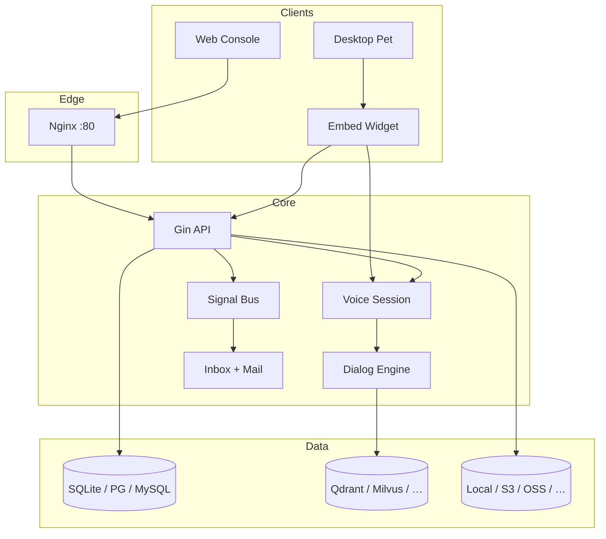

<p align="center">
  
</p>

<h1 align="center">SoulNexus</h1>

<p align="center">
  <strong>AI Voice Dialog Platform</strong><br/>
  <em>Realtime Voice · Assistants · Knowledge · Workflow · MCP · Desktop Pet</em>
</p>

<p align="center">
  <a href="https://go.dev"></a>
  <a href="https://react.dev"></a>
  <a href="https://www.typescriptlang.org"></a>
  <a href="https://www.docker.com"></a>
  <a href="LICENSE"></a>
</p>

<p align="center">
  <a href="#-one-command-deploy">Deploy</a> ·
  <a href="#-capabilities">Capabilities</a> ·
  <a href="#-architecture">Architecture</a> ·
  <a href="#-development">Development</a> ·
  <a href="#-configuration">Configuration</a> ·
  <a href="#-security--notifications">Security</a> ·
  <a href="README_zh.md">中文</a>
</p>

---

## Why SoulNexus

SoulNexus is a full-stack **AI voice dialog platform**: cascading ASR→LLM→TTS (and realtime) conversations, browser WebRTC / WebSocket voice sessions, multi-tenant RBAC, knowledge retrieval, visual workflows, MCP tooling, and a desktop-pet embed client — shipped as one Go binary + React console.

| Pillar | What you get |
|--------|----------------|
| **AI Dialog** | Multi-provider ASR / TTS / LLM, barge-in, hotwords, knowledge RAG |
| **Realtime Voice** | Browser WebRTC / WebSocket voice-session, embed widget, desktop pet |
| **Platform** | Assistants, API Keys (AK/SK), voiceprint, voice clone, workflow & MCP market |
| **Ops** | Prometheus metrics, op-log audit, signal-based inbox + optional email |

---

## ⚡ One-Command Deploy

Requires **Docker** + **Docker Compose v2**. Builds the API (with codecs), embeds the web console, and fronts them with Nginx.

```bash
git clone https://github.com/LingByte/SoulNexus.git
cd SoulNexus
make deploy
```

Open **http://localhost:8080**

| | |
|--|--|
| Default platform admin | `admin@lingecho.com` / `admin123` |
| Override via env | `PLATFORM_ADMIN_EMAIL` · `PLATFORM_ADMIN_PASSWORD` · `PLATFORM_ADMIN_DISPLAY_NAME` |
| HTTP port | `HTTP_PORT=8080` (map host → container `:80`) |

```bash
make logs          # follow container logs
make deploy-seed   # force seed demo data
make clean         # stop + wipe data volume
```

> First boot uses **SQLite** under `/data` when `DB_DRIVER` is unset. For production, set `DB_DRIVER=postgres` (or `mysql`) and a real `DSN`, plus a strong `SESSION_SECRET`.

<details>
<summary>Equivalent docker compose commands</summary>

```bash
cp env.example .env   # optional
docker compose up -d --build
```

</details>

---

## ✨ Capabilities

<table>
  <tr>
    <td width="50%" valign="top">

**Realtime Voice**
- Browser WebRTC / WebSocket voice sessions
- Embed widget + desktop pet client
- Cascaded dialog: ASR → LLM → TTS
- Optional realtime multimodal agents

    </td>
    <td width="50%" valign="top">

**AI Voice Agents**
- Knowledge-augmented answers (hybrid + RRF + rerank)
- Voice clone & voiceprint enrollment
- MCP tools & workflow orchestration
- NLU intent models

    </td>
  </tr>
  <tr>
    <td width="50%" valign="top">

**Platform**
- Assistants with version publish / rollback
- Visual workflows & plugin market
- JS templates for H5 / mini-program embed

    </td>
    <td width="50%" valign="top">

**Multi-Tenant Security**
- JWT (tenant + platform) · API Key AK/SK
- RBAC permissions & operation audit log
- IP allowlists · rate limit · circuit breaker
- Inbox alerts + optional email push

    </td>
  </tr>
</table>

---

## 🏗️ Architecture



**Event model.** Sensitive product actions emit `notify:op_log` (and related signals). Listeners deliver inbox notifications; if the actor enabled `receiveEmailNotify`, a mail is sent as well.

Covered events include: assistant create · API Key create / rotate · voiceprint · voice clone · workflow / MCP publish · password change · tenant provisioning.

---

## 💻 Development

### Prerequisites

| Tool | Version |
|------|---------|
| Go | 1.26+ |
| Node.js | 18+ |
| Docker | 24+ (for image / full stack) |

### Local API + UI

```bash
cp env.example .env
# optional: PLATFORM_ADMIN_EMAIL / PLATFORM_ADMIN_PASSWORD / DSN / mail

go run ./cmd/server -init -seed     # http://localhost:7072

cd web && npm ci && npm run dev     # http://localhost:3000 (proxy /api → backend)
```

### Useful Make / Go targets

```bash
make help
go test ./internal/listeners/ ./internal/constants/ -count=1
go test ./... -cover
```

---

## ⚙️ Configuration

Copy [`env.example`](./env.example) → `.env`. Highlights:

| Variable | Purpose | Default |
|----------|---------|---------|
| `PLATFORM_ADMIN_EMAIL` | Seed platform admin email | `admin@lingecho.com` |
| `PLATFORM_ADMIN_PASSWORD` | Seed platform admin password | `admin123` |
| `PLATFORM_ADMIN_DISPLAY_NAME` | Display name | `Platform Admin` |
| `ADDR` | HTTP listen | `:7072` |
| `DB_DRIVER` / `DSN` | sqlite / postgres / mysql | sqlite `./ling.db` |
| `SESSION_SECRET` | Cookie/session signing | required in prod |

Seed only runs when `platform_admins` is empty — env values override the built-in defaults via `utils.GetEnv`.

---

## 🔐 Security & Notifications

1. **Change the default platform password** immediately after first login.
2. Enable **mail** (`SMTP_*` or SendCloud) for verification codes and optional notification push.
3. Users / platform admins can toggle **Receive email notifications** in profile; verification codes are always delivered.
4. Prefer a long random `SESSION_SECRET`, explicit `CORS_ALLOWED_ORIGINS`, and non-public recording URLs in production.

---

## 📁 Layout

```
SoulNexus/
├── cmd/server              # Process entry
├── cmd/bootstrap           # Migrate · seed · banner
├── internal/handlers       # HTTP API
├── internal/listeners      # Signal observers (mail · notify)
├── pkg/notification        # Mailer + inbox
├── lingllm/                # ASR · TTS · codecs
├── web/                    # React console
├── deploy/                 # Nginx · entrypoint · apt packs
├── Dockerfile
├── docker-compose.yml
├── Makefile                # make deploy
└── env.example
```

---

## 📚 Docs & License

- Product / module notes: [`docs/`](./docs/)
- Chinese guide: [`README_zh.md`](./README_zh.md)
- License: [AGPL-3.0](./LICENSE)

---

<p align="center">
  Built by <a href="https://github.com/LingByte">LingByte</a> · Ship voice AI with conviction.
</p>
