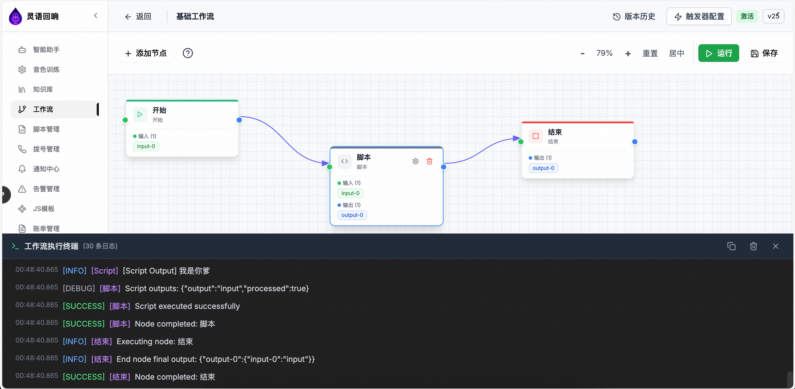
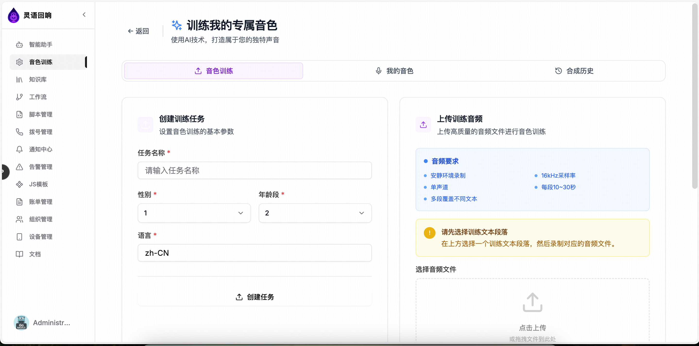
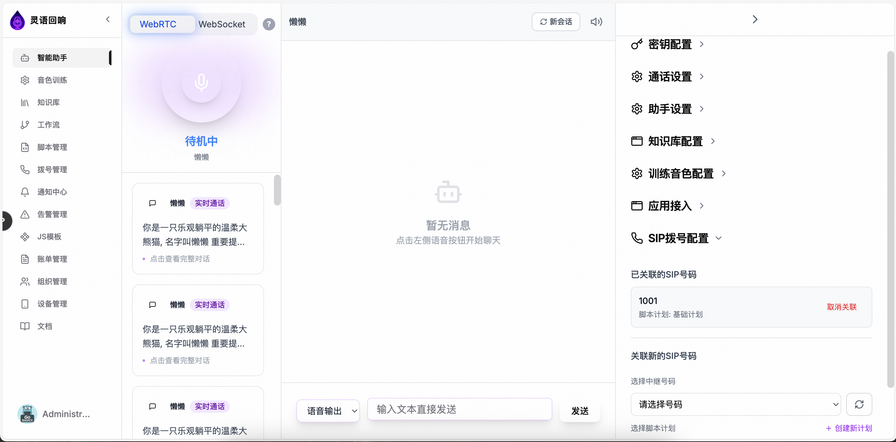
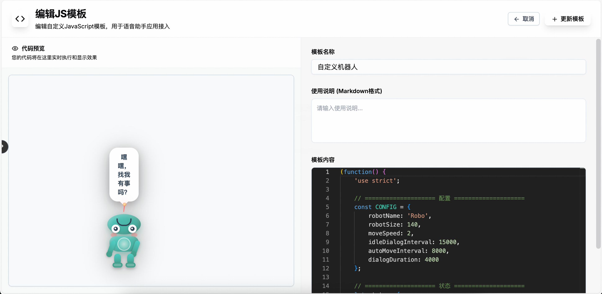
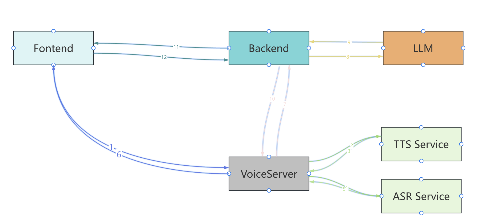
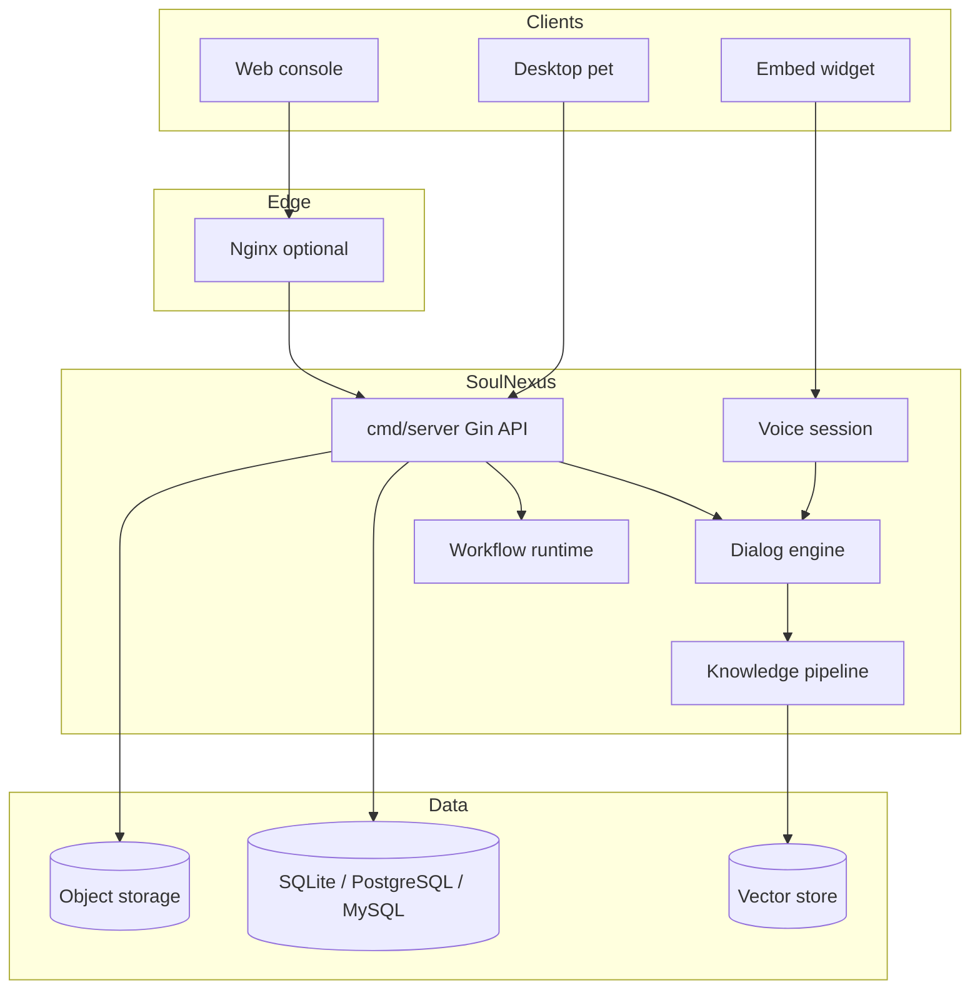

# SoulNexus — Intelligent Voice & Dialog Platform

<div align="center">
  

**Enterprise AI voice, dialog, knowledge, and automation — in one stack**

[](https://go.dev/)
[](https://react.dev/)
[](https://www.typescriptlang.org/)
[](https://docs.docker.com/compose/)
[](LICENSE)

[English](README.md) · [简体中文](README_zh.md)

</div>

---

## 📖 Project Overview

**SoulNexus** is an enterprise-grade **AI voice and dialog platform** built with **Go** and **React**. It connects real-time voice sessions (WebSocket / WebRTC), cascaded **ASR → LLM → TTS** (and optional realtime multimodal), **knowledge retrieval**, **visual workflows**, **MCP tooling**, multi-tenant **RBAC**, and a **desktop pet** client — shipped as a single backend process plus a modern web console.

The product focus is **voice-first AI agents**: configure assistants, clone voices, manage voiceprints, debug conversations with metrics, and embed dialog on the web — without telephony or SIP stacks.

### ✨ Core Features

- **Real-time voice dialog** — Browser WebSocket / WebRTC voice sessions, barge-in, pipeline observability
- **AI assistants** — Versioned publish/rollback, debug console, tool & MCP binding, NLU models
- **Knowledge base** — Ingestion, hybrid + vector search, citations in dialog, multi-backend vectors (Qdrant, Milvus, PGVector, etc.)
- **Workflow automation** — Visual designer, triggers (API, webhook, schedule, assistant), plugin market
- **Voice clone & voiceprint** — Training, enrollment, speaker context for branded voice experiences
- **JS embed templates** — H5 / site widgets for quick integration
- **MCP market** — Tenant-scoped tools and marketplace flows
- **Multi-tenant platform** — Organizations, RBAC, API keys (AK/SK), billing/usage views, audit logs
- **Desktop pet** — Electron client for always-on assistant presence (see `desktop-pet/`)
- **Notifications** — In-app inbox, optional email, operation signals for security-sensitive actions

---

## 🖼️ Product Screenshots

### Workflow automation

<div align="center">
  
  <p><em>Visual workflow editor with triggers and node configuration</em></p>
</div>

### Voice cloning

<div align="center">
  
  <p><em>Voice clone management and synthesis</em></p>
</div>

### Assistant debug

<div align="center">
  
  <p><em>Assistant debug console with latency and knowledge citations</em></p>
</div>

### JS template embed

<div align="center">
  
  <p><em>Embeddable JS templates for web integration</em></p>
</div>

---

## 🏗️ Technical Architecture

<div align="center">
  
</div>



### Runtime layout

| Component | Default | Description |
|-----------|---------|-------------|
| **API + voice dialog** | `:7072` (dev) / `:8080` (Docker via Nginx) | `go run ./cmd/server` — REST, WebSocket, voice-session, workflows, tenants |
| **Web console** | `:3000` (Vite dev) | React + Vite + TypeScript under `web/` |
| **Public marketing** | `/` | Landing page; `/login` for console access |

For deployment topology and env vars, see [docs/deployment.md](docs/deployment.md) and [docs/ops-single-node.md](docs/ops-single-node.md).

---

## 🚀 Quick Start

### Requirements

| Tool | Version |
|------|---------|
| **Go** | 1.26+ |
| **Node.js** | 18+ |
| **npm** / **pnpm** | 8+ |
| **Docker** + **Compose v2** | Recommended for production-like runs |

### Method 1: Docker Compose (recommended)

```bash
git clone https://github.com/LingByte/SoulNexus.git
cd SoulNexus
make deploy
```

Open **http://localhost:8080** (override with `HTTP_PORT` in `.env`).

| | |
|--|--|
| Default platform admin | `admin@lingecho.com` / `admin123` |
| Override | `PLATFORM_ADMIN_EMAIL`, `PLATFORM_ADMIN_PASSWORD`, `PLATFORM_ADMIN_DISPLAY_NAME` |
| Seed demo data | `make deploy-seed` |
| Logs | `make logs` |
| Reset | `make clean` |

First boot uses **SQLite** under the data volume when `DB_DRIVER` is unset. For production, set `DB_DRIVER=postgres` (or `mysql`), a strong `DSN`, and a long random `SESSION_SECRET`.

<details>
<summary>Equivalent compose commands</summary>

```bash
cp env.example .env   # optional
docker compose up -d --build
```

</details>

### Method 2: Local development

```bash
git clone https://github.com/LingByte/SoulNexus.git
cd SoulNexus

cp env.example .env
# Edit SESSION_SECRET, LLM keys, mail, etc. as needed

go run ./cmd/server/main.go -init -seed
# API: http://localhost:7072

cd web
cp .env.example .env
npm ci
npm run dev
# UI: http://localhost:3000  (proxies /api → backend)
```

**Default URLs (dev)**

| URL | Purpose |
|-----|---------|
| http://localhost:3000/ | Marketing landing |
| http://localhost:3000/login | Sign in |
| http://localhost:7072/api | HTTP API |

Change the platform admin password immediately after first login.

---

## ⚙️ Configuration

Copy [`env.example`](env.example) to `.env`. Highlights:

| Variable | Purpose |
|----------|---------|
| `ADDR` | HTTP listen address (e.g. `:7072`) |
| `DB_DRIVER` / `DSN` | Database (sqlite / postgres / mysql) |
| `SESSION_SECRET` | Session signing (required in production) |
| `PLATFORM_ADMIN_*` | First-time platform admin seed |
| `CORS_ALLOWED_ORIGINS` | Browser origins for API |
| LLM / ASR / TTS env | Provider keys and routing (see `env.example`) |

Web console branding (footer company name, ICP, etc.): `web/.env` — `VITE_COMPANY_NAME`, `VITE_ICP_NUMBER`, …

---

## 📚 Documentation

| Document | Description |
|----------|-------------|
| [README_zh.md](README_zh.md) | Chinese guide (detailed) |
| [docs/features-overview.md](docs/features-overview.md) | Feature inventory (current) |
| [docs/deployment.md](docs/deployment.md) | Deployment options |
| [docs/ops-single-node.md](docs/ops-single-node.md) | Single-node operations |
| [docs/mcp-market.md](docs/mcp-market.md) | MCP marketplace |
| [docs/mcp-tenant-tools.md](docs/mcp-tenant-tools.md) | Tenant MCP tools |
| [docs/nlu.md](docs/nlu.md) | NLU models |
| [docs/knowledge-latency.md](docs/knowledge-latency.md) | Knowledge retrieval tuning |
| [docs/soulpet-package-spec.md](docs/soulpet-package-spec.md) | Desktop pet packaging |
| [docs/feature-recommendations.md](docs/feature-recommendations.md) | Product notes |

---

## 📁 Repository Layout

```
SoulNexus/
├── cmd/server/           # Main HTTP API + voice dialog entry
├── cmd/bootstrap/        # Migrations, seeds, startup helpers
├── internal/handlers/    # HTTP handlers
├── pkg/dialog/           # Dialog engine & stages
├── pkg/workflow/         # Workflow engine
├── pkg/knowledge/        # Knowledge indexing & retrieval
├── lingllm/              # ASR / TTS / codec integrations
├── web/                  # React console + landing
├── desktop-pet/          # Electron desktop assistant
├── deploy/               # Nginx, Helm, entrypoint
├── docs/                 # Architecture images & guides
├── Dockerfile
├── docker-compose.yml
├── Makefile
└── env.example
```

---

## 🤝 Contributing

Contributions are welcome. Typical flow:

1. Fork the repository
2. Create a branch: `git checkout -b feature/your-feature`
3. Commit: `git commit -m 'Describe your change'`
4. Push and open a Pull Request

Run tests before submitting:

```bash
go test ./... -count=1
cd web && npm run type-check && npm run build
```

---

## 📧 Contact

- **GitHub**: [LingByte/SoulNexus](https://github.com/LingByte/SoulNexus)
- **Issues**: [GitHub Issues](https://github.com/LingByte/SoulNexus/issues)

---

## ⭐ Star History

[](https://star-history.com/#LingByte/SoulNexus&Date)

---

## 📄 License

This project is licensed under the [GNU Affero General Public License v3.0](LICENSE) (AGPL-3.0).
