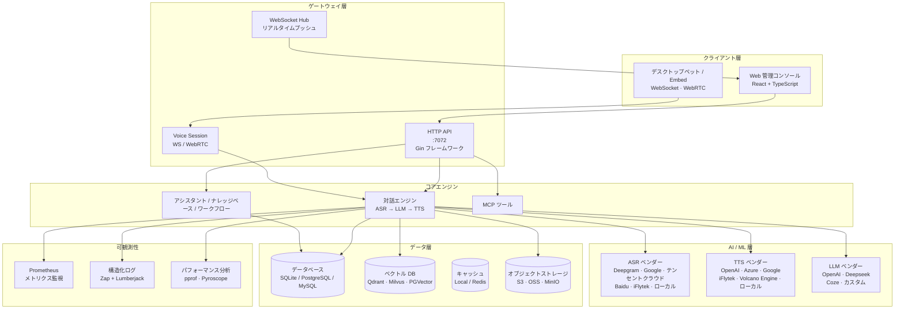
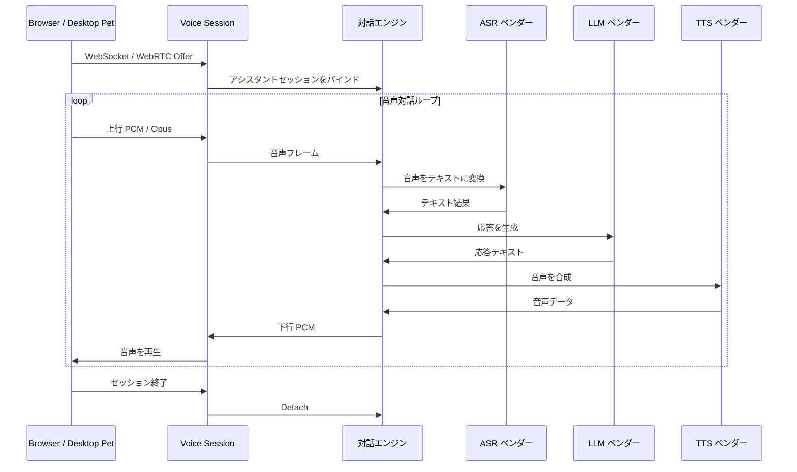
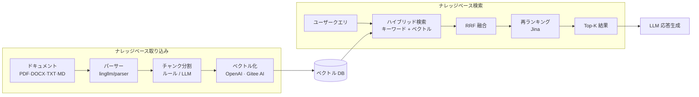
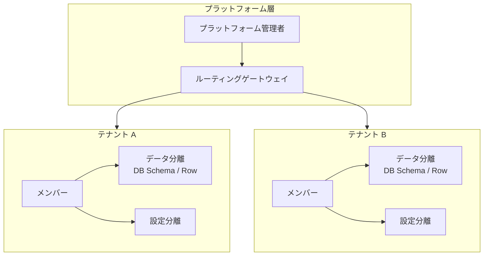

<p align="center">
  <a href="README.md">English</a> · <a href="README_zh.md">简体中文</a> · <a href="README_zh-TW.md">繁體中文</a> · 日本語
</p>

<p align="center">
  
</p>

<h1 align="center">SoulNexus</h1>

<p align="center">
  <strong>AI 音声対話プラットフォーム</strong>
</p>

<p align="center">
  <a href="https://go.dev"></a>
  <a href="https://react.dev"></a>
  <a href="https://www.typescriptlang.org"></a>
  <a href="https://vitejs.dev"></a>
  <a href="https://www.mysql.com"></a>
  <a href="https://github.com/LingByte/SoulNexus/blob/main/LICENSE"></a>
</p>

<p align="center">
  <a href="#-機能">機能</a> ·
  <a href="#-クイックスタート">クイックスタート</a> ·
  <a href="#-システムアーキテクチャ">システムアーキテクチャ</a> ·
  <a href="#-技術スタック">技術スタック</a> ·
  <a href="#-開発ガイド">開発ガイド</a> ·
  <a href="#-デプロイ">デプロイ</a> ·
  <a href="#-ドキュメント">ドキュメント</a>
</p>

---

## ✨ 機能

<table>
  <tr>
    <td width="50%" valign="top">

#### リアルタイム音声

- ブラウザ WebRTC / WebSocket 音声セッション
- Embed 埋め込みコンポーネント + デスクトップペットクライアント
- カスケード対話エンジン：`ASR → LLM → TTS`
- オプションのリアルタイムマルチモーダル対話 Agent

    </td>
    <td width="50%" valign="top">

#### AI 音声アシスタント

- 複数ベンダー ASR / TTS / LLM 統合
- ホットワード検出と割り込み（バージイン）対応
- ナレッジベース強化対話
- ボイスクローンと声紋

    </td>
  </tr>
  <tr>
    <td width="50%" valign="top">

#### プラットフォーム機能

- アシスタントバージョンの公開 / ロールバック
- ビジュアルワークフローとプラグインマーケット
- MCP ツールマーケット
- JS テンプレート（H5 / ミニプログラム埋め込み）

    </td>
    <td width="50%" valign="top">

#### セキュリティとマルチテナント

- JWT + AK/SK 認証
- ロールベースアクセス制御 (RBAC)
- テナント分離とデータ分離
- GitHub OAuth 統合

    </td>
  </tr>
  <tr>
    <td width="50%" valign="top">

#### ナレッジベース

- 複数ベクトル DB：Qdrant、Milvus、PGVector、Elasticsearch、Weaviate
- ドキュメント取り込み：PDF、DOCX、TXT、Markdown、HTML
- ハイブリッド検索（キーワード + ベクトル + RRF 融合）
- Rerank 対応（Jina など）

    </td>
    <td width="50%" valign="top">

#### クラウドストレージとデータベース

- 複数ストレージ：ローカル、S3、OSS、COS、MinIO、TOS、OBS、KS3
- SQLite（開発）/ PostgreSQL / MySQL（本番）
- Redis キャッシュ（オプション）
- メール：SMTP と SendCloud

    </td>
  </tr>
</table>

---

## 🚀 クイックスタート

### 推奨：Docker ワンクリック起動

```bash
git clone https://github.com/LingByte/SoulNexus.git
cd SoulNexus
make deploy
```

ブラウザで **http://localhost:8080** を開く

| ロール | メール | パスワード |
|------|------|------|
| プラットフォーム管理者 | `admin@lingecho.com` | `admin123` |

環境変数でシードアカウントを上書き可能（`platform_admins` が空の場合のみ）：`PLATFORM_ADMIN_EMAIL` / `PLATFORM_ADMIN_PASSWORD` / `PLATFORM_ADMIN_DISPLAY_NAME`。

### ローカル開発

| 依存関係 | バージョン |
|------|------|
| Go | 1.26+ |
| Node.js | 18+ |

```bash
cp env.example .env
go run ./cmd/server -init -seed   # http://localhost:7072
cd web && npm ci && npm run dev   # http://localhost:3000
```

---

## 🏗️ システムアーキテクチャ

### 全体アーキテクチャ



### 音声対話フロー



### ナレッジベースデータフロー



### マルチテナントデータ分離



---

## 🛠️ 技術スタック

<table>
  <tr>
    <th>レイヤー</th>
    <th>技術</th>
  </tr>
  <tr>
    <td><strong>バックエンド</strong></td>
    <td>
      
      
      
      
    </td>
  </tr>
  <tr>
    <td><strong>フロントエンド</strong></td>
    <td>
      
      
      
      
      
      
    </td>
  </tr>
  <tr>
    <td><strong>リアルタイム音声</strong></td>
    <td>
      
      
      
    </td>
  </tr>
  <tr>
    <td><strong>AI / ML</strong></td>
    <td>
      
      
      
      
    </td>
  </tr>
  <tr>
    <td><strong>データベース</strong></td>
    <td>
      
      
      
      
    </td>
  </tr>
  <tr>
    <td><strong>ベクトル DB</strong></td>
    <td>
      
      
      
      
      
    </td>
  </tr>
  <tr>
    <td><strong>ストレージ</strong></td>
    <td>
      
      
      
      
    </td>
  </tr>
  <tr>
    <td><strong>監視</strong></td>
    <td>
      
      
      
      
    </td>
  </tr>
  <tr>
    <td><strong>インフラ</strong></td>
    <td>
      
      
      
    </td>
  </tr>
</table>

---

## 📁 プロジェクト構成

```
SoulNexus/
├── cmd/
│   ├── server/                 # アプリケーションエントリ
│   ├── bootstrap/              # DB 初期化、マイグレーション、シードデータ
│   └── backfill/               # データバックフィルツール
├── internal/
│   ├── config/                 # 環境設定
│   ├── handlers/               # HTTP API ハンドラー
│   ├── models/                 # GORM データベースモデル
│   ├── listeners/              # イベントリスナー
│   ├── tasks/                  # バックグラウンドタスク
│   └── workflow/               # ワークフロー定義
├── pkg/
│   ├── dialog/                 # 音声対話エンジン（voice-session 含む）
│   ├── voice/                  # 音声処理 ASR/TTS
│   ├── vad/                    # 音声区間検出 (VAD)
│   ├── knowledge/              # ナレッジベースサービス
│   ├── billing/                # 課金
│   ├── notification/           # 通知システム
│   ├── middleware/             # HTTP ミドルウェア
│   ├── i18n/                   # 国際化
│   └── stores/                 # オブジェクトストレージアダプター
├── lingllm/                    # LLM / RAG / リアルタイム音声基盤
├── lingmcp/                    # MCP 関連モジュール
├── voiceprint/                 # 声紋サービス
├── desktop-pet/                # デスクトップペットクライアント
├── web/
│   └── src/
│       ├── pages/              # コンソールページ
│       ├── api/                # API クライアントモジュール
│       ├── stores/             # Zustand 状態管理
│       ├── components/         # 共有 React コンポーネント
│       ├── i18n/               # 国際化翻訳
│       └── utils/              # ユーティリティ関数
├── deploy/                     # Docker / Helm / Nginx
├── docs/                       # ドキュメント
├── scripts/                    # ビルドとデプロイスクリプト
├── nginx/                      # Nginx 設定
├── Dockerfile                  # Docker イメージ
├── docker-compose.yml          # Docker Compose
├── Makefile                    # ビルドコマンド
└── env.example                 # 環境変数テンプレート
```

---

## 💻 開発ガイド

### バックエンドコマンド

```bash
# 開発モードで起動
go run ./cmd/server

# データベースマイグレーション + デモデータ取り込み
go run ./cmd/server -init -seed

# すべてのテストを実行
go test ./... -cover

# 指定パッケージのテストを実行
go test ./pkg/dialog/... -v
```

### フロントエンドコマンド

```bash
cd web

# 依存関係をインストール
npm install

# 開発サーバー
npm run dev

# 本番ビルド
npm run build

# リントと型チェック
npm run lint
npm run type-check
```

### Docker

```bash
# 初回：.env を生成
make env

# すべてのサービスをビルドして起動
make deploy

# ログを表示
make logs

# サービスを停止
make down
```

---

## 🐳 デプロイ

### Docker Compose ワンクリックデプロイ

```bash
make deploy
# コンソール http://localhost:8080
# make logs / make clean / make deploy-seed
```

### 本番環境チェックリスト

- [ ] `GIN_MODE=release` を設定
- [ ] `SESSION_SECRET` を設定（32 バイト以上のランダム文字列）
- [ ] `CORS_ALLOWED_ORIGINS` を自分のドメインに設定
- [ ] SSL/TLS 証明書を設定
- [ ] SQLite の代わりに PostgreSQL を使用
- [ ] マルチインスタンスキャッシュ用に Redis を設定
- [ ] `UPLOADS_RECORDINGS_PUBLIC` を無効化
- [ ] ベクトル DB を設定（Qdrant 推奨）

---

## 📚 ドキュメント

| ドキュメント | 説明 |
|------|------|
| [機能概要](docs/features-overview.md) | 現在の機能一覧と成熟度 |
| [デプロイガイド](docs/deployment.md) | Docker ワンクリックデプロイ |
| [ナレッジベース運用](docs/knowledge-ops-closed-loop-zh.md) | ナレッジベースワークフロー |
| [MCP マーケット](docs/mcp-market.md) | テナント MCP 有効化とバインド |
| [環境変数設定](env.example) | 設定項目の説明 |

---

## 🤝 コントリビューション

```bash
# 1. リポジトリを Fork
# 2. 機能ブランチを作成
git checkout -b feature/amazing-feature

# 3. 変更をコミット
git commit -m 'feat: add amazing feature'

# 4. ブランチにプッシュ
git push origin feature/amazing-feature

# 5. Pull Request を作成
```

---

## 📄 ライセンス

本プロジェクトは **GNU Affero General Public License v3.0** に基づいてライセンスされています — 詳細は [LICENSE](LICENSE) ファイルを参照してください。

---

<p align="center">
  <a href="https://github.com/LingByte">LingByte</a> が心を込めて制作 ❤️
</p>
