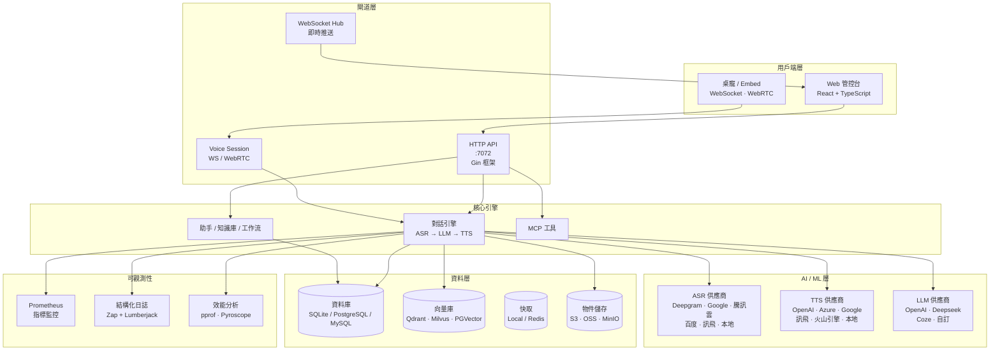
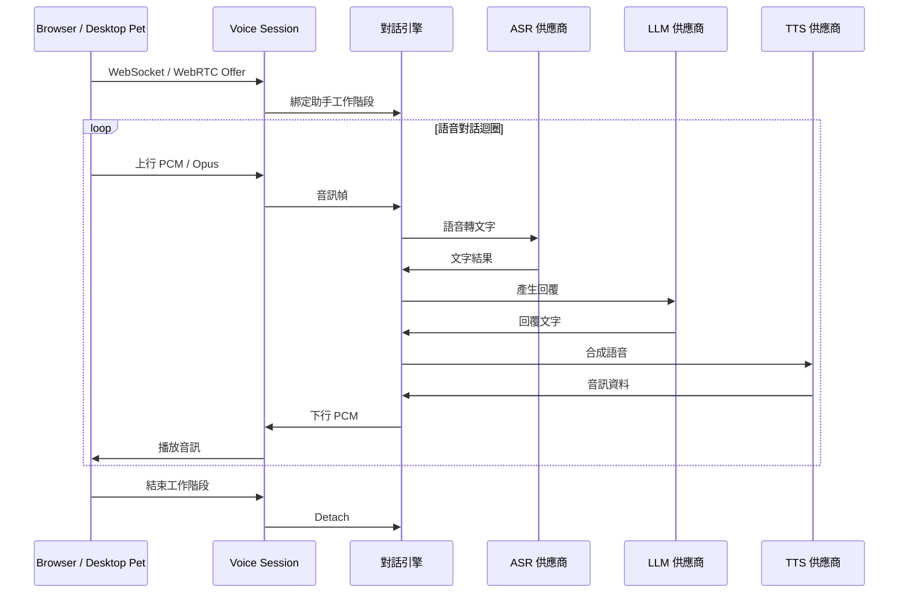
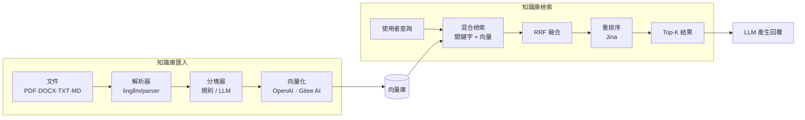
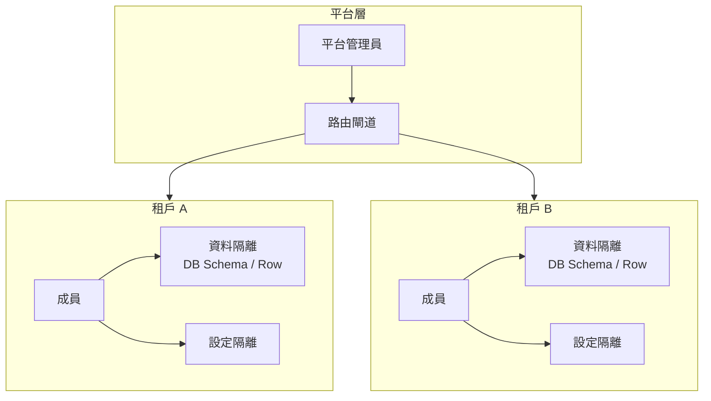

<p align="center">
  <a href="README.md">English</a> · <a href="README_zh.md">简体中文</a> · 繁體中文 · <a href="README_ja.md">日本語</a>
</p>

<p align="center">
  
</p>

<h1 align="center">SoulNexus</h1>

<p align="center">
  <strong>AI 語音對話平台</strong>
</p>

<p align="center">
  <a href="https://go.dev"></a>
  <a href="https://react.dev"></a>
  <a href="https://www.typescriptlang.org"></a>
  <a href="https://vitejs.dev"></a>
  <a href="https://www.mysql.com"></a>
  <a href="https://github.com/LingByte/SoulNexus/blob/main/LICENSE"></a>
</p>

<p align="center">
  <a href="#-功能特性">功能特性</a> ·
  <a href="#-快速開始">快速開始</a> ·
  <a href="#-系統架構">系統架構</a> ·
  <a href="#-技術棧">技術棧</a> ·
  <a href="#-開發指南">開發指南</a> ·
  <a href="#-部署方案">部署方案</a> ·
  <a href="#-文件">文件</a>
</p>

---

## ✨ 功能特性

<table>
  <tr>
    <td width="50%" valign="top">

#### 即時語音

- 瀏覽器 WebRTC / WebSocket 語音工作階段
- Embed 嵌入元件 + 桌寵用戶端
- 級聯對話引擎：`ASR → LLM → TTS`
- 可選即時多模態對話 Agent

    </td>
    <td width="50%" valign="top">

#### AI 語音助手

- 多供應商 ASR / TTS / LLM 整合
- 熱詞偵測與打斷支援
- 知識庫增強對話
- 聲音克隆與聲紋

    </td>
  </tr>
  <tr>
    <td width="50%" valign="top">

#### 平台能力

- 助手版本發布 / 回滾
- 視覺化工作流與外掛市場
- MCP 工具市場
- JS 模板（H5 / 小程序嵌入）

    </td>
    <td width="50%" valign="top">

#### 安全與多租戶

- JWT + AK/SK 認證
- 基於角色的存取控制 (RBAC)
- 租戶隔離與資料隔離
- GitHub OAuth 整合

    </td>
  </tr>
  <tr>
    <td width="50%" valign="top">

#### 知識庫

- 多向量庫：Qdrant、Milvus、PGVector、Elasticsearch、Weaviate
- 文件匯入：PDF、DOCX、TXT、Markdown、HTML
- 混合檢索 (關鍵字 + 向量 + RRF 融合)
- Rerank 支援 (Jina 等)

    </td>
    <td width="50%" valign="top">

#### 雲端儲存與資料庫

- 多儲存：本地、S3、OSS、COS、MinIO、TOS、OBS、KS3
- SQLite (開發) / PostgreSQL / MySQL (正式環境)
- Redis 快取 (可選)
- 郵件：SMTP 與 SendCloud

    </td>
  </tr>
</table>

---

## 🚀 快速開始

### 推薦：Docker 一鍵啟動

```bash
git clone https://github.com/LingByte/SoulNexus.git
cd SoulNexus
make deploy
```

瀏覽器開啟 **http://localhost:8080**

| 角色 | 電子郵件 | 密碼 |
|------|------|------|
| 平台管理員 | `admin@lingecho.com` | `admin123` |

可透過環境變數覆寫種子帳號（僅 `platform_admins` 為空時生效）：`PLATFORM_ADMIN_EMAIL` / `PLATFORM_ADMIN_PASSWORD` / `PLATFORM_ADMIN_DISPLAY_NAME`。

### 本地開發

| 依賴 | 版本 |
|------|------|
| Go | 1.26+ |
| Node.js | 18+ |

```bash
cp env.example .env
go run ./cmd/server -init -seed   # http://localhost:7072
cd web && npm ci && npm run dev   # http://localhost:3000
```

---

## 🏗️ 系統架構

### 整體架構



### 語音對話流程



### 知識庫資料流



### 多租戶資料隔離



---

## 🛠️ 技術棧

<table>
  <tr>
    <th>層級</th>
    <th>技術</th>
  </tr>
  <tr>
    <td><strong>後端</strong></td>
    <td>
      
      
      
      
    </td>
  </tr>
  <tr>
    <td><strong>前端</strong></td>
    <td>
      
      
      
      
      
      
    </td>
  </tr>
  <tr>
    <td><strong>即時語音</strong></td>
    <td>
      
      
      
    </td>
  </tr>
  <tr>
    <td><strong>AI / ML</strong></td>
    <td>
      
      
      
      
    </td>
  </tr>
  <tr>
    <td><strong>資料庫</strong></td>
    <td>
      
      
      
      
    </td>
  </tr>
  <tr>
    <td><strong>向量庫</strong></td>
    <td>
      
      
      
      
      
    </td>
  </tr>
  <tr>
    <td><strong>儲存</strong></td>
    <td>
      
      
      
      
    </td>
  </tr>
  <tr>
    <td><strong>監控</strong></td>
    <td>
      
      
      
      
    </td>
  </tr>
  <tr>
    <td><strong>基礎設施</strong></td>
    <td>
      
      
      
    </td>
  </tr>
</table>

---

## 📁 專案結構

```
SoulNexus/
├── cmd/
│   ├── server/                 # 應用程式入口
│   ├── bootstrap/              # 資料庫初始化、遷移、種子資料
│   └── backfill/               # 資料回填工具
├── internal/
│   ├── config/                 # 環境設定
│   ├── handlers/               # HTTP API 處理器
│   ├── models/                 # GORM 資料庫模型
│   ├── listeners/              # 事件監聽器
│   ├── tasks/                  # 背景任務
│   └── workflow/               # 工作流定義
├── pkg/
│   ├── dialog/                 # 語音對話引擎（含 voice-session）
│   ├── voice/                  # 語音處理 ASR/TTS
│   ├── vad/                    # 語音活動偵測
│   ├── knowledge/              # 知識庫服務
│   ├── billing/                # 計費
│   ├── notification/           # 通知系統
│   ├── middleware/             # HTTP 中介軟體
│   ├── i18n/                   # 國際化
│   └── stores/                 # 物件儲存適配器
├── lingllm/                    # LLM / RAG / 即時語音底座
├── lingmcp/                    # MCP 相關模組
├── voiceprint/                 # 聲紋服務
├── desktop-pet/                # 桌寵用戶端
├── web/
│   └── src/
│       ├── pages/              # 控制台頁面
│       ├── api/                # API 用戶端模組
│       ├── stores/             # Zustand 狀態管理
│       ├── components/         # 共用 React 元件
│       ├── i18n/               # 國際化翻譯
│       └── utils/              # 工具函式
├── deploy/                     # Docker / Helm / Nginx
├── docs/                       # 文件
├── scripts/                    # 建置與部署腳本
├── nginx/                      # Nginx 設定
├── Dockerfile                  # Docker 映像
├── docker-compose.yml          # Docker Compose
├── Makefile                    # 建置命令
└── env.example                 # 環境變數範本
```

---

## 💻 開發指南

### 後端命令

```bash
# 開發模式啟動
go run ./cmd/server

# 資料庫遷移 + 匯入演示資料
go run ./cmd/server -init -seed

# 執行所有測試
go test ./... -cover

# 執行指定套件的測試
go test ./pkg/dialog/... -v
```

### 前端命令

```bash
cd web

# 安裝依賴
npm install

# 開發伺服器
npm run dev

# 正式環境建置
npm run build

# 程式碼檢查與型別檢查
npm run lint
npm run type-check
```

### Docker

```bash
# 首次：產生 .env
make env

# 建置並啟動所有服務
make deploy

# 查看日誌
make logs

# 停止服務
make down
```

---

## 🐳 部署方案

### Docker Compose 一鍵部署

```bash
make deploy
# 控制台 http://localhost:8080
# make logs / make clean / make deploy-seed
```

### 正式環境檢查清單

- [ ] 設定 `GIN_MODE=release`
- [ ] 設定 `SESSION_SECRET` (32+ 位元組隨機字串)
- [ ] 設定 `CORS_ALLOWED_ORIGINS` 為您的網域
- [ ] 設定 SSL/TLS 憑證
- [ ] 使用 PostgreSQL 替代 SQLite
- [ ] 設定 Redis 用於多實例快取
- [ ] 關閉 `UPLOADS_RECORDINGS_PUBLIC`
- [ ] 設定向量庫 (推薦 Qdrant)

---

## 📚 文件

| 文件 | 說明 |
|------|------|
| [功能匯總](docs/features-overview.md) | 目前功能清單與成熟度 |
| [部署指南](docs/deployment.md) | Docker 一鍵部署 |
| [知識庫營運](docs/knowledge-ops-closed-loop-zh.md) | 知識庫工作流 |
| [MCP 市場](docs/mcp-market.md) | 租戶 MCP 開通與綁定 |
| [環境變數設定](env.example) | 設定項說明 |

---

## 🤝 貢獻指南

```bash
# 1. Fork 儲存庫
# 2. 建立功能分支
git checkout -b feature/amazing-feature

# 3. 提交變更
git commit -m 'feat: add amazing feature'

# 4. 推送到分支
git push origin feature/amazing-feature

# 5. 建立 Pull Request
```

---

## 📄 授權條款

本專案基於 **GNU Affero 通用公共授權條款 v3.0** — 詳見 [LICENSE](LICENSE) 文件。

---

<p align="center">
  由 <a href="https://github.com/LingByte">LingByte</a> 傾心打造 ❤️
</p>
