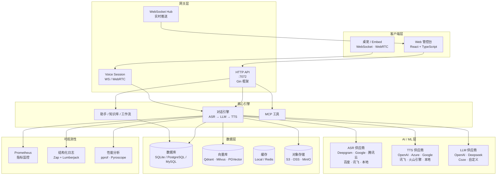
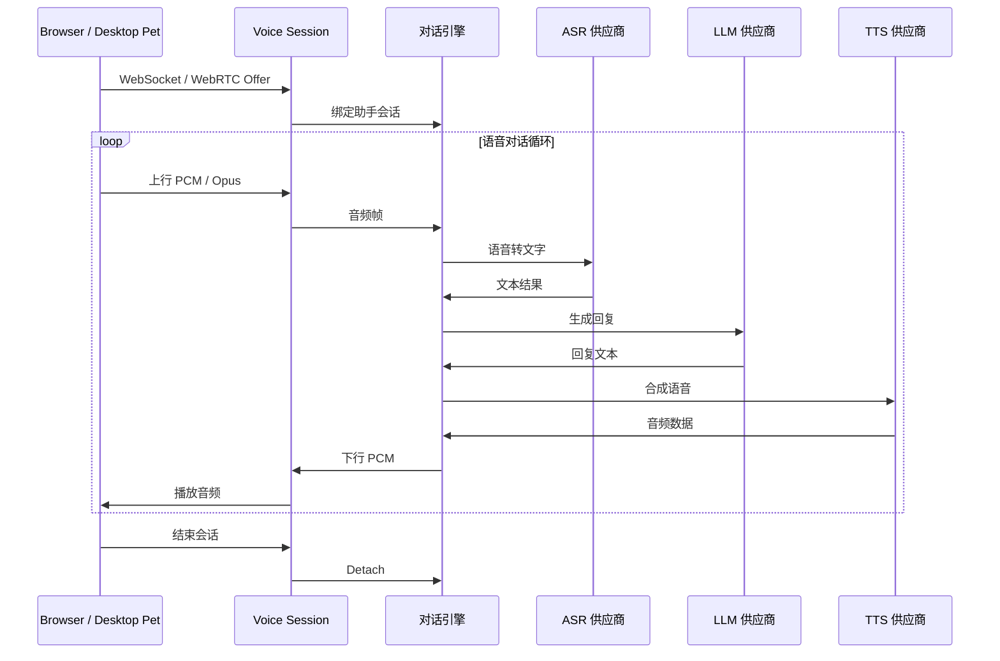
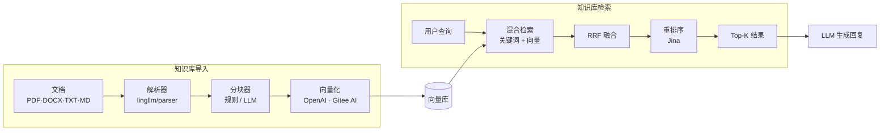
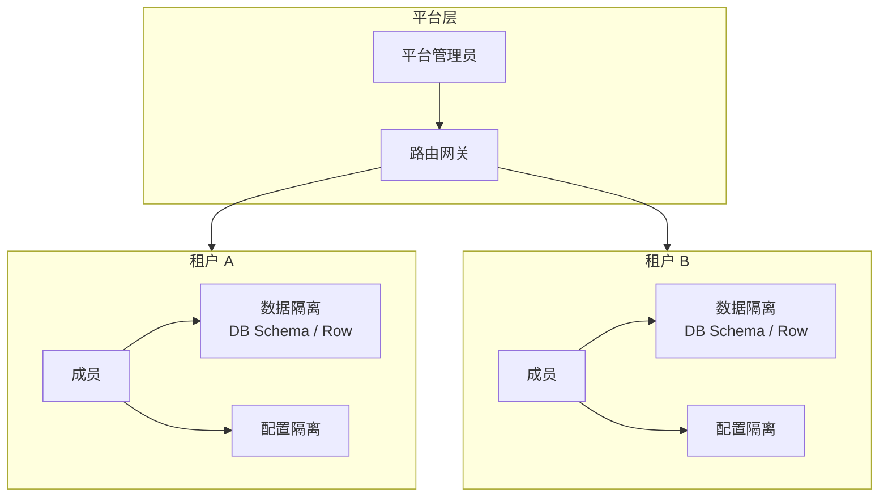

<p align="center">
  
</p>

<h1 align="center">SoulNexus</h1>

<p align="center">
  <strong>AI 语音对话平台</strong>
</p>

<p align="center">
  <a href="https://go.dev"></a>
  <a href="https://react.dev"></a>
  <a href="https://www.typescriptlang.org"></a>
  <a href="https://vitejs.dev"></a>
  <a href="https://www.mysql.com"></a>
  <a href="https://github.com/LingByte/SoulNexus/blob/main/LICENSE"></a>
</p>

<p align="center">
  <a href="#-功能特性">功能特性</a> ·
  <a href="#-快速开始">快速开始</a> ·
  <a href="#-系统架构">系统架构</a> ·
  <a href="#-技术栈">技术栈</a> ·
  <a href="#-开发指南">开发指南</a> ·
  <a href="#-部署方案">部署方案</a> ·
  <a href="#-文档">文档</a>
</p>

---

## ✨ 功能特性

<table>
  <tr>
    <td width="50%" valign="top">

#### 实时语音

- 浏览器 WebRTC / WebSocket 语音会话
- Embed 嵌入组件 + 桌宠客户端
- 级联对话引擎：`ASR → LLM → TTS`
- 可选实时多模态对话 Agent

    </td>
    <td width="50%" valign="top">

#### AI 语音助手

- 多供应商 ASR / TTS / LLM 集成
- 热词检测 & 打断支持
- 知识库增强对话
- 声音克隆 & 声纹

    </td>
  </tr>
  <tr>
    <td width="50%" valign="top">

#### 平台能力

- 助手版本发布 / 回滚
- 可视化工作流 & 插件市场
- MCP 工具市场
- JS 模板（H5 / 小程序嵌入）

    </td>
    <td width="50%" valign="top">

#### 安全 & 多租户

- JWT + AK/SK 认证
- 基于角色的访问控制 (RBAC)
- 租户隔离与数据隔离
- GitHub OAuth 集成

    </td>
  </tr>
  <tr>
    <td width="50%" valign="top">

#### 知识库

- 多向量库：Qdrant、Milvus、PGVector、Elasticsearch、Weaviate
- 文档导入：PDF、DOCX、TXT、Markdown、HTML
- 混合检索 (关键词 + 向量 + RRF 融合)
- Rerank 支持 (Jina 等)

    </td>
    <td width="50%" valign="top">

#### 云存储 & 数据库

- 多存储：本地、S3、OSS、COS、MinIO、TOS、OBS、KS3
- SQLite (开发) / PostgreSQL / MySQL (生产)
- Redis 缓存 (可选)
- 邮件：SMTP & SendCloud

    </td>
  </tr>
</table>

---

## 🚀 快速开始

### 推荐：Docker 一键启动

```bash
git clone https://github.com/LingByte/SoulNexus.git
cd SoulNexus
make deploy
```

浏览器打开 **http://localhost:8080**

| 角色 | 邮箱 | 密码 |
|------|------|------|
| 平台管理员 | `admin@lingecho.com` | `admin123` |

可通过环境变量覆盖种子账号（仅 `platform_admins` 为空时生效）：`PLATFORM_ADMIN_EMAIL` / `PLATFORM_ADMIN_PASSWORD` / `PLATFORM_ADMIN_DISPLAY_NAME`。

### 本地开发

| 依赖 | 版本 |
|------|------|
| Go | 1.26+ |
| Node.js | 18+ |

```bash
cp env.example .env
go run ./cmd/server -init -seed   # http://localhost:7072
cd web && npm ci && npm run dev   # http://localhost:3000
```

---

## 🏗️ 系统架构

### 整体架构



### 语音对话流程



### 知识库数据流



### 多租户数据隔离



---

## 🛠️ 技术栈

<table>
  <tr>
    <th>层级</th>
    <th>技术</th>
  </tr>
  <tr>
    <td><strong>后端</strong></td>
    <td>
      
      
      
      
    </td>
  </tr>
  <tr>
    <td><strong>前端</strong></td>
    <td>
      
      
      
      
      
      
    </td>
  </tr>
  <tr>
    <td><strong>实时语音</strong></td>
    <td>
      
      
      
    </td>
  </tr>
  <tr>
    <td><strong>AI / ML</strong></td>
    <td>
      
      
      
      
    </td>
  </tr>
  <tr>
    <td><strong>数据库</strong></td>
    <td>
      
      
      
      
    </td>
  </tr>
  <tr>
    <td><strong>向量库</strong></td>
    <td>
      
      
      
      
      
    </td>
  </tr>
  <tr>
    <td><strong>存储</strong></td>
    <td>
      
      
      
      
    </td>
  </tr>
  <tr>
    <td><strong>监控</strong></td>
    <td>
      
      
      
      
    </td>
  </tr>
  <tr>
    <td><strong>基础设施</strong></td>
    <td>
      
      
      
    </td>
  </tr>
</table>

---

## 📁 项目结构

```
SoulNexus/
├── cmd/
│   ├── server/                 # 应用入口
│   ├── bootstrap/              # 数据库初始化、迁移、种子数据
│   └── backfill/               # 数据回填工具
├── internal/
│   ├── config/                 # 环境配置
│   ├── handlers/               # HTTP API 处理器
│   ├── models/                 # GORM 数据库模型
│   ├── listeners/              # 事件监听器
│   ├── tasks/                  # 后台任务
│   └── workflow/               # 工作流定义
├── pkg/
│   ├── dialog/                 # 语音对话引擎（含 voice-session）
│   ├── voice/                  # 语音处理 ASR/TTS
│   ├── vad/                    # 语音活动检测
│   ├── knowledge/              # 知识库服务
│   ├── billing/                # 计费
│   ├── notification/           # 通知系统
│   ├── middleware/             # HTTP 中间件
│   ├── i18n/                   # 国际化
│   └── stores/                 # 对象存储适配器
├── lingllm/                    # LLM / RAG / 实时语音底座
├── lingmcp/                    # MCP 相关模块
├── voiceprint/                 # 声纹服务
├── desktop-pet/                # 桌宠客户端
├── web/
│   └── src/
│       ├── pages/              # 控制台页面
│       ├── api/                # API 客户端模块
│       ├── stores/             # Zustand 状态管理
│       └── components/         # 共享 React 组件
├── deploy/                     # Docker / Helm / Nginx
└── docs/                       # 文档
```
│       ├── i18n/               # 国际化翻译
│       └── utils/              # 工具函数
├── docs/                       # 文档
├── scripts/                    # 构建 & 部署脚本
├── nginx/                      # Nginx 配置
├── deploy/                     # 部署配置
├── Dockerfile                  # Docker 镜像
├── docker-compose.yml          # Docker Compose
├── Makefile                    # 构建命令
└── env.example                 # 环境变量模板
```

---

## 💻 开发指南

### 后端命令

```bash
# 开发模式启动
go run ./cmd/server

# 数据库迁移 + 导入演示数据
go run ./cmd/server -init -seed

# 运行所有测试
go test ./... -cover

# 运行指定包的测试
go test ./pkg/dialog/... -v
```

### 前端命令

```bash
cd web

# 安装依赖
npm install

# 开发服务器
npm run dev

# 生产构建
npm run build

# 代码检查 & 类型检查
npm run lint
npm run type-check
```

### Docker

```bash
# 首次：生成 .env
make env

# 构建并启动所有服务
make deploy

# 查看日志
make logs

# 停止服务
make down
```

---

## 🐳 部署方案

### Docker Compose 一键部署

```bash
make deploy
# 控制台 http://localhost:8080
# make logs / make clean / make deploy-seed
```

### 生产环境检查清单

- [ ] 设置 `GIN_MODE=release`
- [ ] 配置 `SESSION_SECRET` (32+ 字节随机字符串)
- [ ] 设置 `CORS_ALLOWED_ORIGINS` 为你的域名
- [ ] 配置 SSL/TLS 证书
- [ ] 使用 PostgreSQL 替代 SQLite
- [ ] 配置 Redis 用于多实例缓存
- [ ] 关闭 `UPLOADS_RECORDINGS_PUBLIC`
- [ ] 配置向量库 (推荐 Qdrant)

---

## 📚 文档

| 文档 | 说明 |
|------|------|
| [部署指南](docs/deployment.md) | Docker 一键部署 |
| [知识库运营](docs/knowledge-ops-closed-loop-zh.md) | 知识库工作流 |
| [NLU](docs/nlu.md) | 意图 NLU 实验室 |
| [MCP 市场](docs/mcp-market.md) | 租户 MCP 开通与绑定 |
| [环境变量配置](env.example) | 配置项说明 |

---

## 🤝 贡献指南

```bash
# 1. Fork 仓库
# 2. 创建特性分支
git checkout -b feature/amazing-feature

# 3. 提交更改
git commit -m 'feat: add amazing feature'

# 4. 推送到分支
git push origin feature/amazing-feature

# 5. 创建 Pull Request
```

---

## 📄 许可证

本项目基于 **GNU Affero 通用公共许可证 v3.0** — 详见 [LICENSE](LICENSE) 文件。

---

<p align="center">
  由 <a href="https://github.com/LingByte">LingByte</a> 倾心打造 ❤️
</p>

