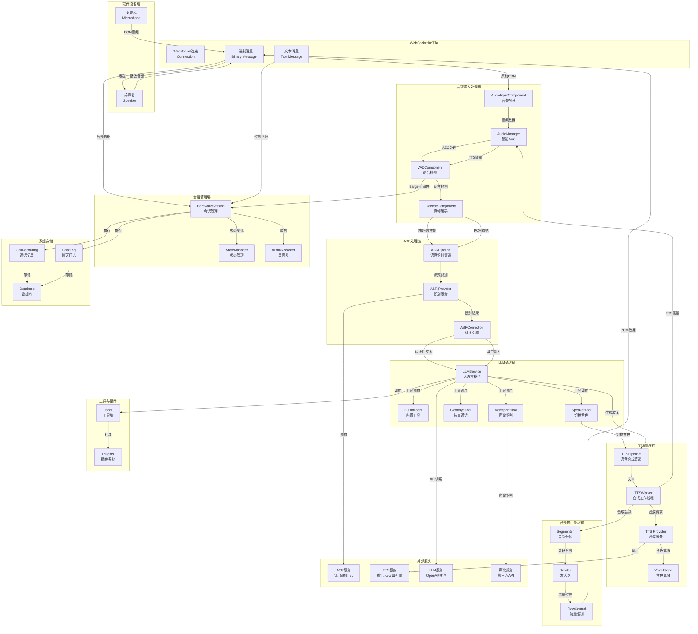

# pkg/hardware 硬件通话流程架构图

## 硬件通话完整流程架构



## 核心组件详解

### 1. 会话管理层 (pkg/hardware/protocol)

#### HardwareSession
- **职责**: 管理整个硬件通话会话的生命周期
- **功能**:
  - WebSocket 连接管理
  - 消息路由和分发
  - 会话状态跟踪
  - 错误处理和恢复

#### StateManager
- **职责**: 管理 ASR 处理的状态机
- **状态**:
  - IDLE: 空闲状态
  - LISTENING: 监听中
  - PROCESSING: 处理中
  - SPEAKING: 播放中

#### AudioRecorder
- **职责**: 本地录音存储
- **功能**:
  - WAV 格式录音
  - 音频数据写入
  - 文件管理

### 2. 音频输入处理链 (pkg/hardware/sessions)

#### AudioInputComponent
- **职责**: 捕获和初步处理输入音频
- **功能**:
  - PCM 音频接收
  - 数据验证
  - 缓冲管理

#### AudioManager (智能AEC)
- **职责**: 智能回声消除
- **算法**:
  - 基于能量比较的 AEC
  - 参数:
    - `EchoThresholdMultiplier = 1.5`: 回声检测倍数
    - `MinUserVoiceEnergy = 3000`: 最小用户语音能量
  - 支持用户打断 (Barge-in)

#### VADComponent
- **职责**: 语音活动检测
- **功能**:
  - 远程 Silero VAD 服务调用
  - 连续帧检测 (5帧 = 100ms)
  - Barge-in 事件触发
  - 参数:
    - `threshold`: VAD 阈值 (0-1)
    - `consecutiveFrames`: 连续检测帧数

#### DecodeComponent
- **职责**: 音频解码
- **功能**:
  - PCM 格式转换
  - 采样率处理

### 3. ASR处理链 (pkg/hardware/sessions + pkg/recognizer)

#### ASRPipeline
- **职责**: 语音识别管道
- **功能**:
  - 流式识别
  - 连接管理
  - 自动重连
  - 指标收集

#### ASR Provider
- **支持的服务**:
  - 讯飞 (Xunfei)
  - 腾讯云 (QCloud)
  - 百度 (Baidu)
  - Google
  - 其他

#### ASRCorrection
- **职责**: 识别结果纠正
- **功能**:
  - 文本后处理
  - 敏感词过滤
  - 格式规范化

### 4. LLM处理链 (pkg/hardware/tools)

#### LLMService
- **职责**: 大语言模型调用
- **功能**:
  - 文本生成
  - 工具调用
  - 上下文管理
  - 流式输出

#### 内置工具
- **BuiltinTools**: 基础工具集
- **SpeakerTool**: 音色切换
- **GoodbyeTool**: 通话结束
- **VoiceprintTool**: 声纹识别

### 5. TTS处理链 (pkg/hardware/stream)

#### TTSPipeline
- **职责**: 语音合成管道
- **功能**:
  - 文本队列管理
  - 并发合成
  - 音频缓冲
  - 流量控制

#### TTSWorker
- **职责**: 合成工作线程
- **功能**:
  - 单个文本合成
  - 音频分段
  - 能量记录

#### TTS Provider
- **支持的服务**:
  - 腾讯云 (QCloud)
  - 火山引擎 (Volcengine)
  - 讯飞 (Xunfei)
  - OpenAI
  - 其他

#### VoiceClone
- **职责**: 音色克隆
- **功能**:
  - 克隆音色合成
  - 多提供商支持

### 6. 音频输出处理链 (pkg/hardware/stream)

#### Segmenter
- **职责**: 音频分段
- **功能**:
  - 固定大小分段
  - 时间戳管理

#### Sender
- **职责**: 音频发送
- **功能**:
  - WebSocket 发送
  - 二进制编码

#### FlowControl
- **职责**: 流量控制
- **功能**:
  - 缓冲区管理
  - 背压处理
  - 速率限制

## 数据流向

### 完整通话流程

```
1. 用户说话
   Microphone → WebSocket → AudioInput → AudioManager(AEC) → VAD

2. 语音检测
   VAD → (检测到语音) → ASRPipeline → ASR Provider → 识别文本

3. 文本处理
   识别文本 → ASRCorrection → LLMService → 生成回复

4. 语音合成
   生成回复 → TTSPipeline → TTS Provider → 合成音频

5. 音频输出
   合成音频 → Segmenter → Sender → WebSocket → Speaker

6. 数据记录
   所有过程 → CallRecording → Database
```

## 关键特性

### 1. 智能回声消除 (Smart AEC)
- 基于能量比较的算法
- 支持用户打断
- 参数可调

### 2. 语音检测 (VAD)
- 远程 Silero VAD 服务
- 连续帧检测
- Barge-in 支持

### 3. 实时处理
- 流式 ASR
- 流式 LLM
- 流式 TTS

### 4. 会话管理
- 完整的状态机
- 错误恢复
- 资源清理

### 5. 音色支持
- 多种 TTS 提供商
- 音色克隆
- 动态切换

### 6. 工具系统
- 内置工具
- 插件扩展
- LLM 工具调用
