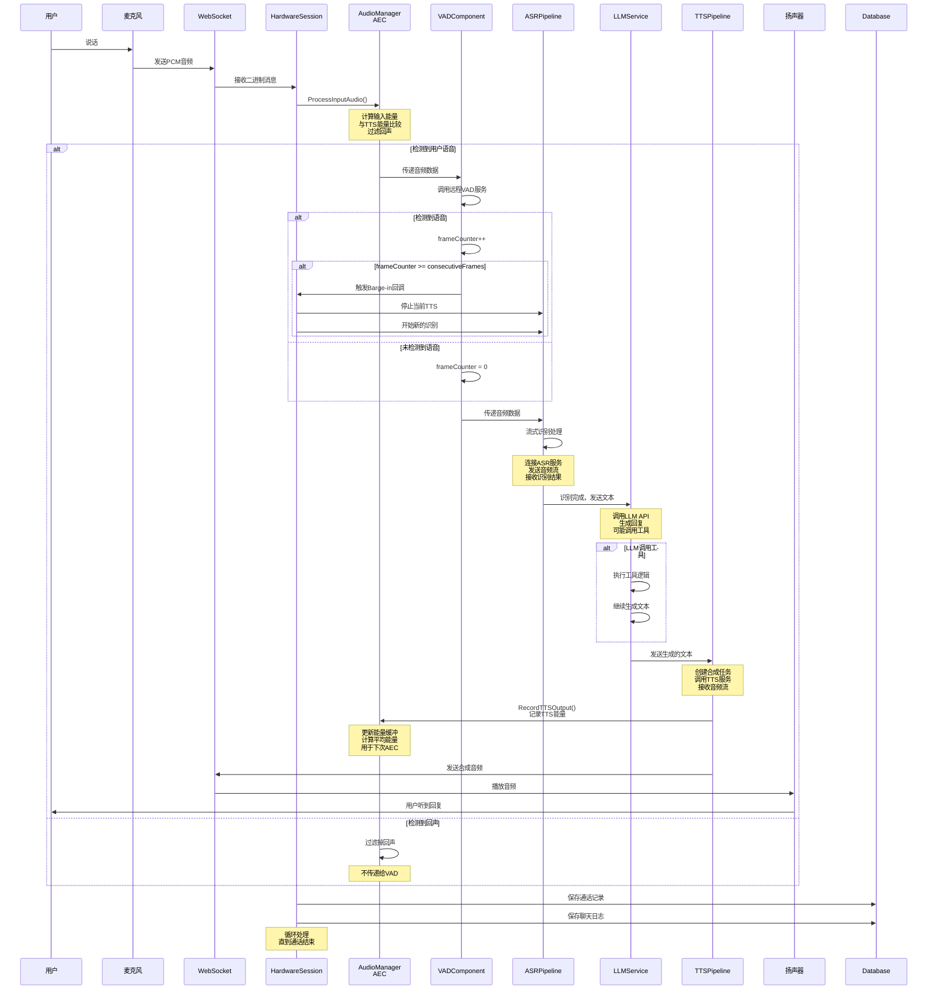
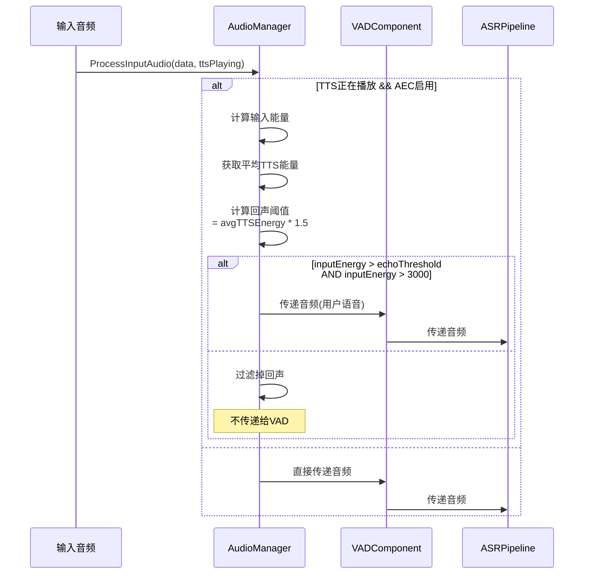
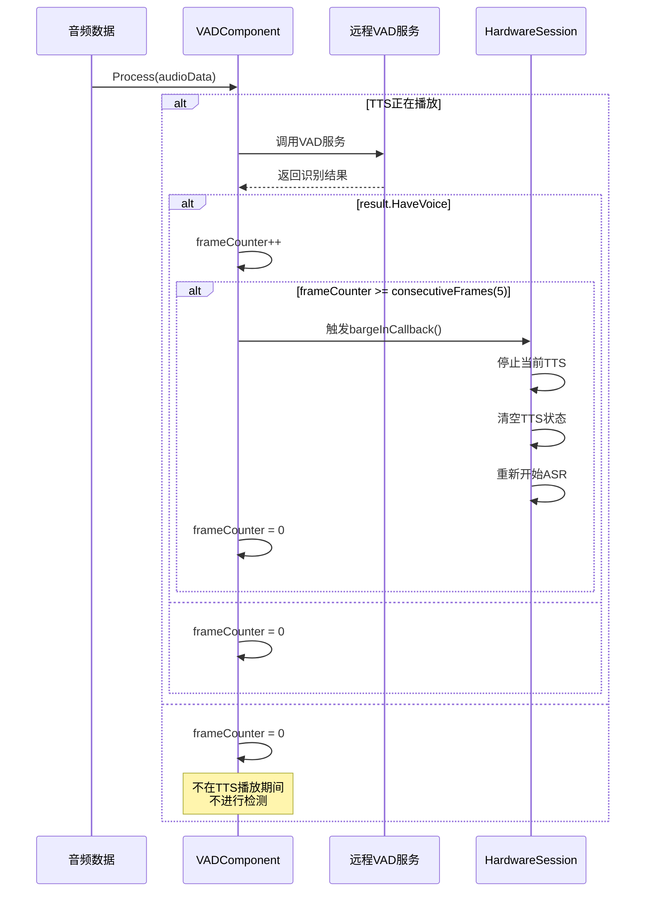
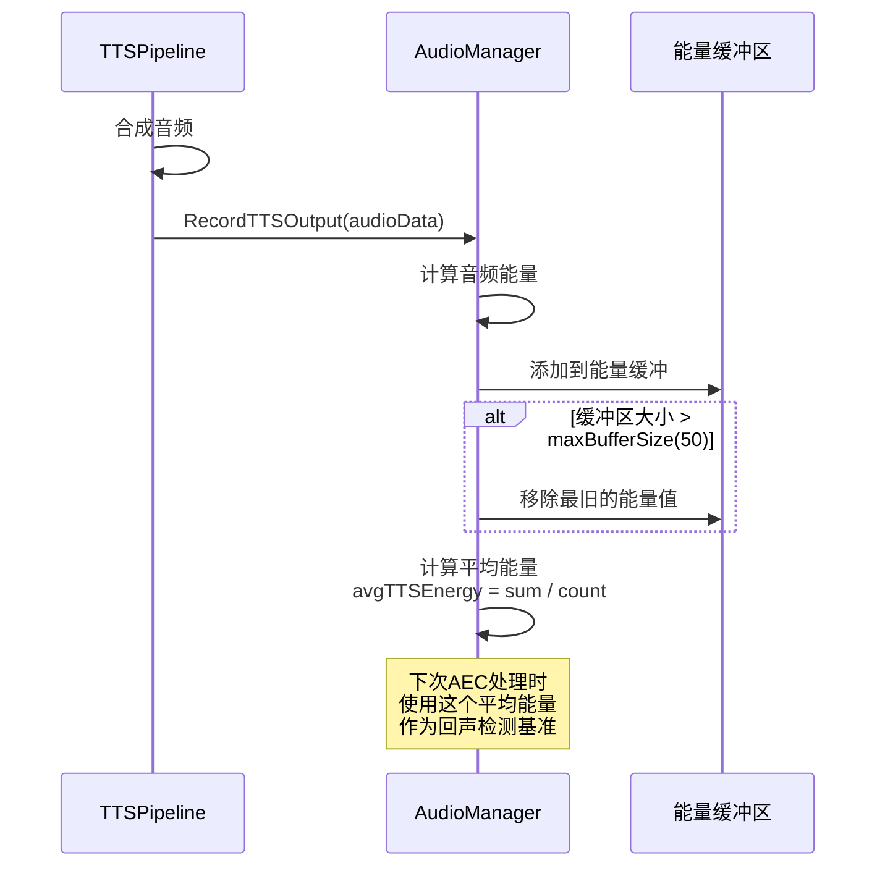
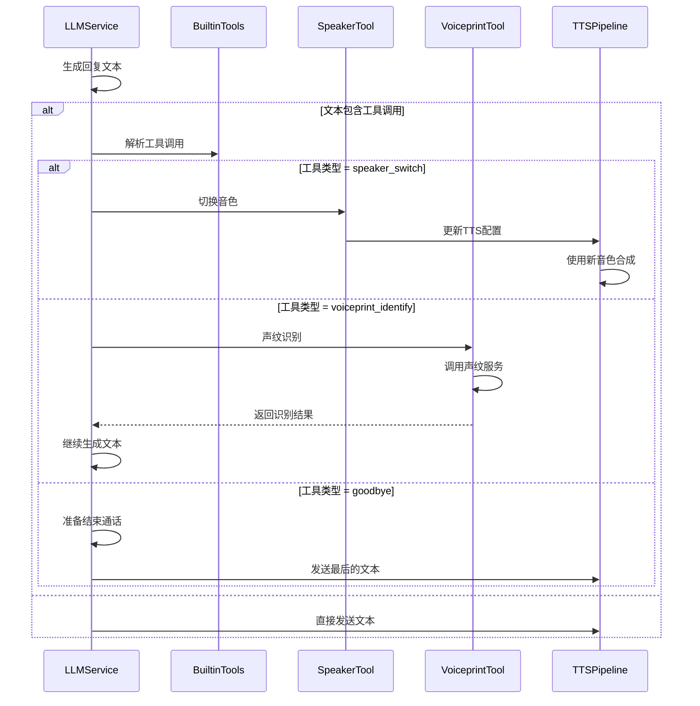
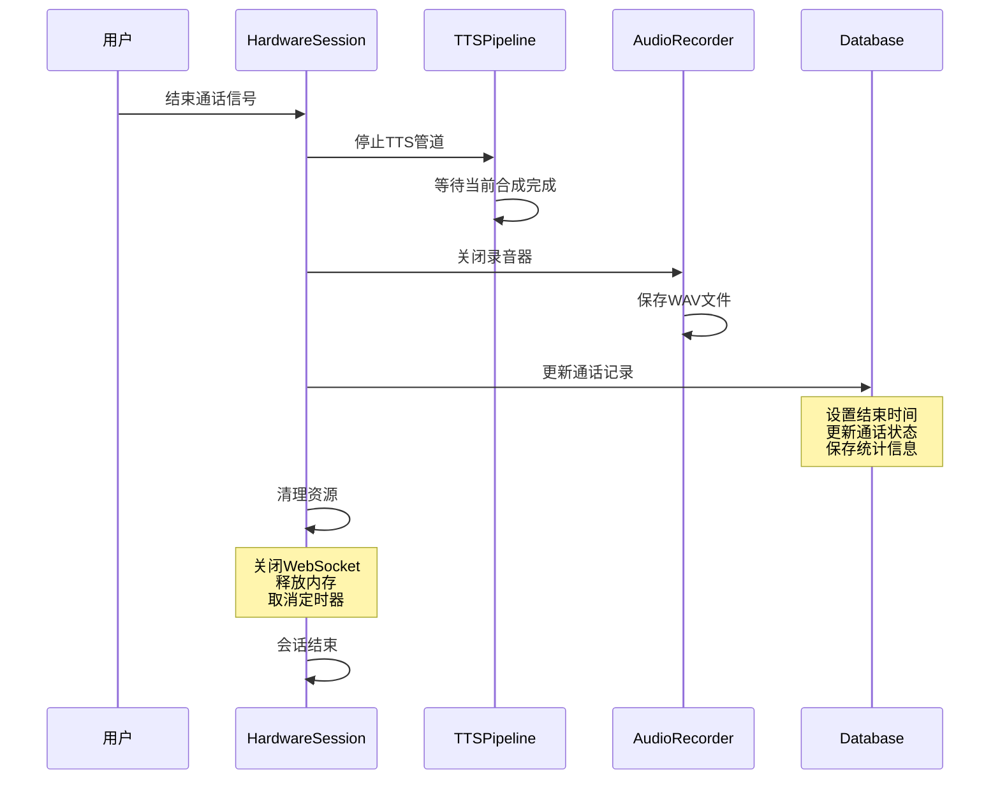
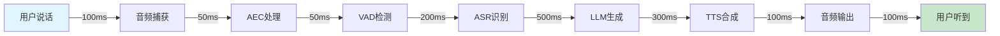
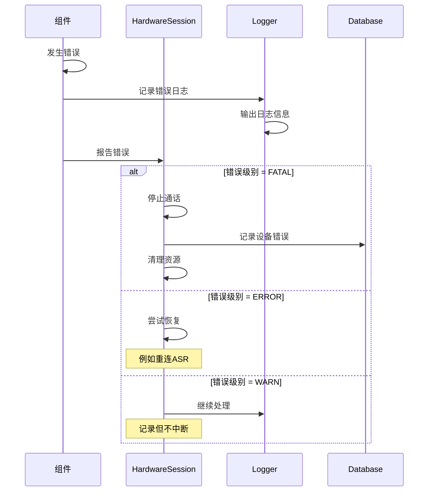
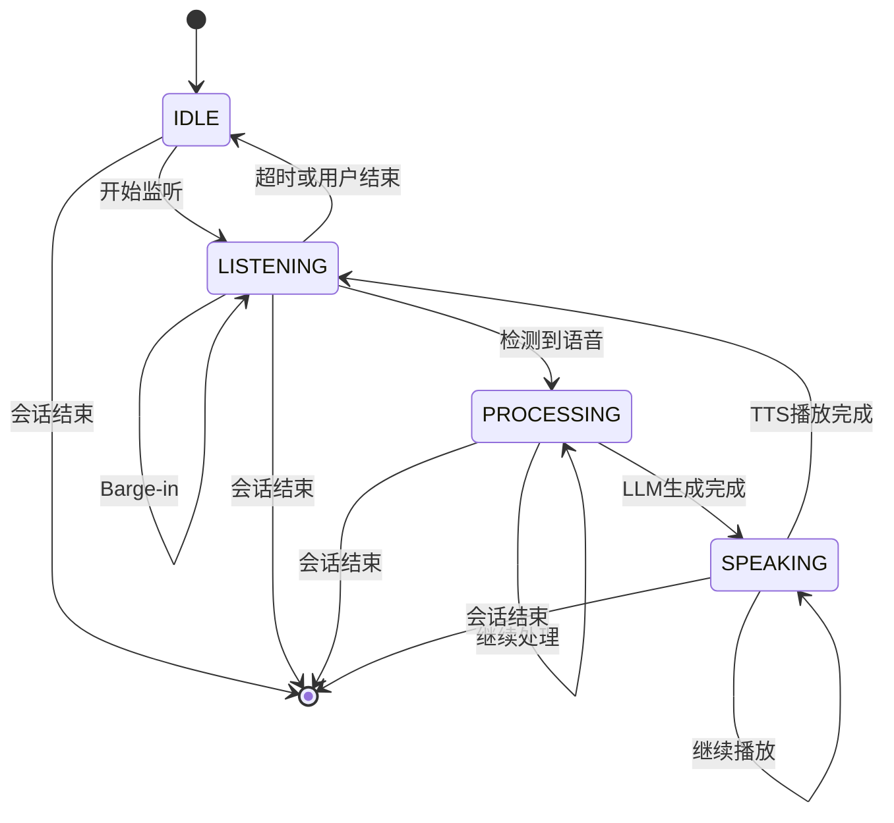

# 硬件通话时序图

## 完整通话时序流程

```mermaid
sequenceDiagram
    participant User as 用户
    participant Mic as 麦克风
    participant WS as WebSocket
    participant Session as HardwareSession
    participant AudioMgr as AudioManager<br/>AEC
    participant VAD as VADComponent
    participant ASR as ASRPipeline
    participant LLM as LLMService
    participant TTS as TTSPipeline
    participant Speaker as 扬声器
    participant DB as Database

    User->>Mic: 说话
    Mic->>WS: 发送PCM音频
    WS->>Session: 接收二进制消息
    
    Session->>AudioMgr: ProcessInputAudio()
    Note over AudioMgr: 计算输入能量<br/>与TTS能量比较<br/>过滤回声
    
    alt 检测到用户语音
        AudioMgr->>VAD: 传递音频数据
        VAD->>VAD: 调用远程VAD服务
        
        alt 检测到语音
            VAD->>VAD: frameCounter++
            
            alt frameCounter >= consecutiveFrames
                VAD->>Session: 触发Barge-in回调
                Session->>ASR: 停止当前TTS
                Session->>ASR: 开始新的识别
            end
        else 未检测到语音
            VAD->>VAD: frameCounter = 0
        end
        
        VAD->>ASR: 传递音频数据
        ASR->>ASR: 流式识别处理
        
        Note over ASR: 连接ASR服务<br/>发送音频流<br/>接收识别结果
        
        ASR->>LLM: 识别完成，发送文本
        
        Note over LLM: 调用LLM API<br/>生成回复<br/>可能调用工具
        
        alt LLM调用工具
            LLM->>LLM: 执行工具逻辑
            LLM->>LLM: 继续生成文本
        end
        
        LLM->>TTS: 发送生成的文本
        
        Note over TTS: 创建合成任务<br/>调用TTS服务<br/>接收音频流
        
        TTS->>AudioMgr: RecordTTSOutput()<br/>记录TTS能量
        
        Note over AudioMgr: 更新能量缓冲<br/>计算平均能量<br/>用于下次AEC
        
        TTS->>WS: 发送合成音频
        WS->>Speaker: 播放音频
        Speaker->>User: 用户听到回复
        
    else 检测到回声
        AudioMgr->>AudioMgr: 过滤掉回声
        Note over AudioMgr: 不传递给VAD
    end
    
    Session->>DB: 保存通话记录
    Session->>DB: 保存聊天日志
    
    Note over Session: 循环处理<br/>直到通话结束
```

## 关键交互细节

### 1. 音频输入处理流程

```mermaid
sequenceDiagram
    participant Input as 输入音频
    participant AudioMgr as AudioManager
    participant VAD as VADComponent
    participant ASR as ASRPipeline

    Input->>AudioMgr: ProcessInputAudio(data, ttsPlaying)
    
    alt TTS正在播放 && AEC启用
        AudioMgr->>AudioMgr: 计算输入能量
        AudioMgr->>AudioMgr: 获取平均TTS能量
        AudioMgr->>AudioMgr: 计算回声阈值<br/>= avgTTSEnergy * 1.5
        
        alt inputEnergy > echoThreshold<br/>AND inputEnergy > 3000
            AudioMgr->>VAD: 传递音频(用户语音)
            VAD->>ASR: 传递音频
        else
            AudioMgr->>AudioMgr: 过滤掉回声
            Note over AudioMgr: 不传递给VAD
        end
    else
        AudioMgr->>VAD: 直接传递音频
        VAD->>ASR: 传递音频
    end
```

### 2. VAD Barge-in 检测流程

```mermaid
sequenceDiagram
    participant Audio as 音频数据
    participant VAD as VADComponent
    participant RemoteVAD as 远程VAD服务
    participant Session as HardwareSession

    Audio->>VAD: Process(audioData)
    
    alt TTS正在播放
        VAD->>RemoteVAD: 调用VAD服务
        RemoteVAD-->>VAD: 返回识别结果
        
        alt result.HaveVoice
            VAD->>VAD: frameCounter++
            
            alt frameCounter >= consecutiveFrames(5)
                VAD->>Session: 触发bargeInCallback()
                Session->>Session: 停止当前TTS
                Session->>Session: 清空TTS状态
                Session->>Session: 重新开始ASR
                VAD->>VAD: frameCounter = 0
            end
        else
            VAD->>VAD: frameCounter = 0
        end
    else
        VAD->>VAD: frameCounter = 0
        Note over VAD: 不在TTS播放期间<br/>不进行检测
    end
```

### 3. TTS能量记录与AEC反馈

```mermaid
sequenceDiagram
    participant TTS as TTSPipeline
    participant AudioMgr as AudioManager
    participant Buffer as 能量缓冲区

    TTS->>TTS: 合成音频
    TTS->>AudioMgr: RecordTTSOutput(audioData)
    
    AudioMgr->>AudioMgr: 计算音频能量
    AudioMgr->>Buffer: 添加到能量缓冲
    
    alt 缓冲区大小 > maxBufferSize(50)
        AudioMgr->>Buffer: 移除最旧的能量值
    end
    
    AudioMgr->>AudioMgr: 计算平均能量<br/>avgTTSEnergy = sum / count
    
    Note over AudioMgr: 下次AEC处理时<br/>使用这个平均能量<br/>作为回声检测基准
```

### 4. LLM工具调用流程

```mermaid
sequenceDiagram
    participant LLM as LLMService
    participant Tools as BuiltinTools
    participant SpeakerTool as SpeakerTool
    participant VoiceprintTool as VoiceprintTool
    participant TTS as TTSPipeline

    LLM->>LLM: 生成回复文本
    
    alt 文本包含工具调用
        LLM->>Tools: 解析工具调用
        
        alt 工具类型 = speaker_switch
            LLM->>SpeakerTool: 切换音色
            SpeakerTool->>TTS: 更新TTS配置
            TTS->>TTS: 使用新音色合成
        else 工具类型 = voiceprint_identify
            LLM->>VoiceprintTool: 声纹识别
            VoiceprintTool->>VoiceprintTool: 调用声纹服务
            VoiceprintTool-->>LLM: 返回识别结果
            LLM->>LLM: 继续生成文本
        else 工具类型 = goodbye
            LLM->>LLM: 准备结束通话
            LLM->>TTS: 发送最后的文本
        end
    else
        LLM->>TTS: 直接发送文本
    end
```

### 5. 通话结束流程

```mermaid
sequenceDiagram
    participant User as 用户
    participant Session as HardwareSession
    participant TTS as TTSPipeline
    participant Recorder as AudioRecorder
    participant DB as Database

    User->>Session: 结束通话信号
    
    Session->>TTS: 停止TTS管道
    TTS->>TTS: 等待当前合成完成
    
    Session->>Recorder: 关闭录音器
    Recorder->>Recorder: 保存WAV文件
    
    Session->>DB: 更新通话记录
    Note over DB: 设置结束时间<br/>更新通话状态<br/>保存统计信息
    
    Session->>Session: 清理资源
    Note over Session: 关闭WebSocket<br/>释放内存<br/>取消定时器
    
    Session->>Session: 会话结束
```

## 性能指标

### 关键延迟

```mermaid
graph LR
    A["用户说话"] -->|100ms| B["音频捕获"]
    B -->|50ms| C["AEC处理"]
    C -->|50ms| D["VAD检测"]
    D -->|200ms| E["ASR识别"]
    E -->|500ms| F["LLM生成"]
    F -->|300ms| G["TTS合成"]
    G -->|100ms| H["音频输出"]
    H -->|100ms| I["用户听到"]
    
    style A fill:#e1f5ff
    style I fill:#c8e6c9
```

### 总延迟: ~1.4秒

## 错误处理流程

```mermaid
sequenceDiagram
    participant Component as 组件
    participant Session as HardwareSession
    participant Logger as Logger
    participant DB as Database

    Component->>Component: 发生错误
    
    Component->>Logger: 记录错误日志
    Logger->>Logger: 输出日志信息
    
    Component->>Session: 报告错误
    
    alt 错误级别 = FATAL
        Session->>Session: 停止通话
        Session->>DB: 记录设备错误
        Session->>Session: 清理资源
    else 错误级别 = ERROR
        Session->>Session: 尝试恢复
        Note over Session: 例如重连ASR
    else 错误级别 = WARN
        Session->>Logger: 继续处理
        Note over Session: 记录但不中断
    end
```

## 状态机

```mermaid
stateDiagram-v2
    [*] --> IDLE
    
    IDLE --> LISTENING: 开始监听
    LISTENING --> PROCESSING: 检测到语音
    PROCESSING --> SPEAKING: LLM生成完成
    SPEAKING --> LISTENING: TTS播放完成
    LISTENING --> IDLE: 超时或用户结束
    
    LISTENING --> LISTENING: Barge-in
    PROCESSING --> PROCESSING: 继续处理
    SPEAKING --> SPEAKING: 继续播放
    
    IDLE --> [*]: 会话结束
    LISTENING --> [*]: 会话结束
    PROCESSING --> [*]: 会话结束
    SPEAKING --> [*]: 会话结束
```
