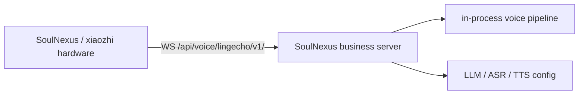
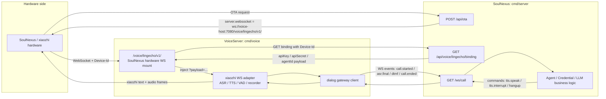
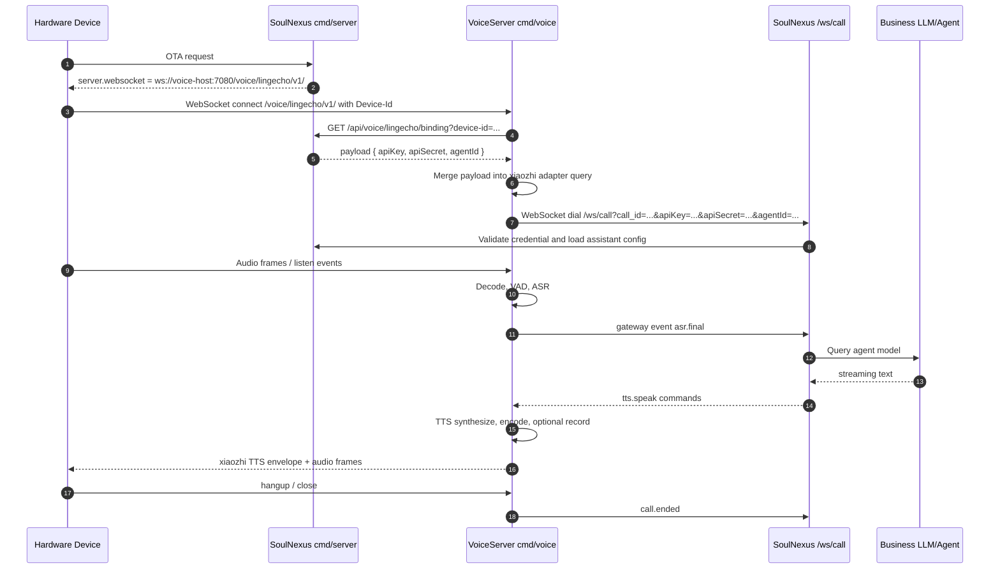
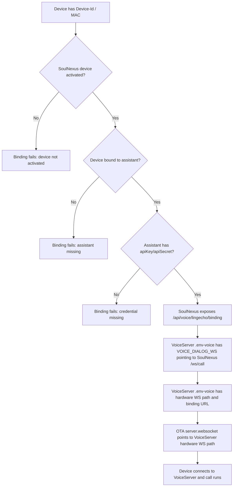
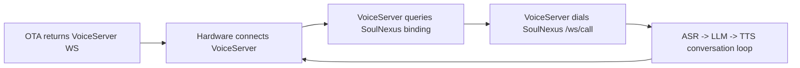
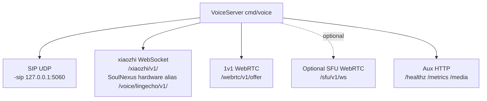

# Hardware Connection Through VoiceServer

## 背景

之前硬件设备拿到 OTA 返回的 `server.websocket` 后，通常直接连接 SoulNexus：



现在推荐把媒体接入面拆到 `cmd/voice` 的 VoiceServer。硬件先连接 VoiceServer，VoiceServer 再向 SoulNexus 获取设备绑定的助手凭证，并把通话事件通过 dialog WebSocket 转给 SoulNexus 业务端。



## 新链路时序



## 跑通条件



关键配置关系：

| 配置点 | 建议值 / 示例 | 作用 |
| --- | --- | --- |
| SoulNexus `server.websocket` | `ws://voice-host:7080/voice/lingecho/v1/` | OTA 返回给硬件的新 WebSocket 地址 |
| VoiceServer `VOICE_HTTP_ADDR` | `127.0.0.1:7080` | 承载 xiaozhi WS、SoulNexus hardware WS、WebRTC、SFU 等 HTTP 入口 |
| VoiceServer `VOICE_DIALOG_WS` | `ws://localhost:7072/ws/call` | VoiceServer 向业务端转交通话事件的 dialog WebSocket |
| VoiceServer `VOICE_LINGECHO_HW_WS_PATH` | `/voice/lingecho/v1/` | 硬件实际连接 VoiceServer 的路径 |
| VoiceServer `VOICE_LINGECHO_HW_BINDING_URL` | `http://localhost:7072/api/voice/lingecho/binding` | VoiceServer 按 `Device-Id` 查询助手凭证 payload |
| `LINGECHO_HARDWARE_BINDING_SECRET` | 两边一致，可选 | 保护 binding API，只允许可信 VoiceServer 调用 |

示例启动方式：

```bash
go run ./cmd/server/main.go -mode=dev
go run ./cmd/voice
```

如果配置了 binding secret：

```bash
export LINGECHO_HARDWARE_BINDING_SECRET='replace-with-shared-secret'
export VOICE_LINGECHO_HW_BINDING_SECRET="$LINGECHO_HARDWARE_BINDING_SECRET"
go run ./cmd/voice
```

## 是否能跑通

从当前代码链路看，新方式是闭合的：



需要注意的失败点主要有四个：

1. `server.websocket` 没有改成 VoiceServer 的 `/voice/lingecho/v1/`，设备会继续走旧的 SoulNexus 直连路径。
2. VoiceServer 没有设置 `VOICE_DIALOG_WS`，xiaozhi/SoulNexus WS adapter 不会挂载成功。
3. VoiceServer 没有设置 `VOICE_LINGECHO_HW_BINDING_URL`，`/voice/lingecho/v1/` 这个硬件兼容入口不会挂载。
4. 设备的 `Device-Id` 没有在 SoulNexus 里激活或没有绑定助手，binding API 会拒绝返回 payload。

## VoiceServer 当前接入类型

当前 `cmd/voice` 的通话接入面主要是三类：



严格按“一对一 AI 通话入口”看，是三种：`SIP`、`xiaozhi/SoulNexus WebSocket`、`WebRTC`。

另外代码里还有一个可选 `SFU`，通过 `VOICE_ENABLE_SFU=true` 开启，走 `/sfu/v1/ws`，它是多人音视频转发能力，不是同一个一对一 AI 通话入口；如果按 VoiceServer 暴露的媒体能力统计，它算第四类可选能力。`/healthz`、`/metrics`、`/media` 是辅助 HTTP 端点，不算独立通话协议。
