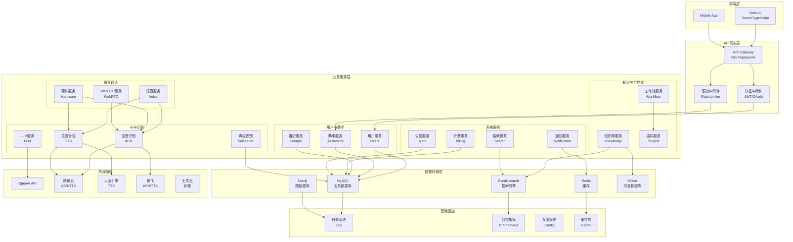

# SoulNexus 项目模块架构图

## 整体项目架构

## 核心模块说明

### 1. 前端层 (Web/Mobile)
- **Web UI**: React + TypeScript 构建的管理后台
- **Mobile App**: 移动端应用

### 2. API网关层
- **Gin Framework**: 高性能HTTP框架
- **认证中间件**: JWT/OAuth 身份验证
- **限流中间件**: 请求限流和熔断

### 3. 业务服务层

#### 用户与助手
- **用户服务**: 用户管理、认证、授权
- **助手服务**: AI助手配置、管理
- **组织服务**: 组织/团队管理

#### 语音通话
- **语音服务**: WebSocket 语音通话
- **硬件服务**: 硬件设备通话
- **WebRTC服务**: 实时通信

#### 知识与工作流
- **知识库服务**: 文档管理、向量化、检索
- **工作流服务**: 流程编排、自动化
- **插件服务**: 第三方插件集成

#### AI与识别
- **LLM服务**: 大语言模型调用
- **ASR服务**: 语音识别
- **TTS服务**: 语音合成
- **声纹识别**: 用户身份验证

#### 系统服务
- **计费服务**: 用量统计、计费
- **告警服务**: 系统告警
- **通知服务**: 邮件、短信通知
- **搜索服务**: 全文搜索

### 4. 数据存储层
- **MySQL**: 关系数据存储
- **Redis**: 缓存和会话存储
- **Elasticsearch**: 日志和全文搜索
- **Neo4j**: 知识图谱存储
- **Milvus**: 向量数据库

### 5. 外部服务集成
- **OpenAI**: GPT 模型
- **腾讯云**: ASR/TTS 服务
- **火山引擎**: TTS 服务
- **讯飞**: ASR/TTS 服务
- **灵枢**: 文件存储

### 6. 基础设施
- **日志系统**: Zap 日志框架
- **监控指标**: Prometheus 指标收集
- **配置管理**: 动态配置
- **缓存层**: 多层缓存策略
