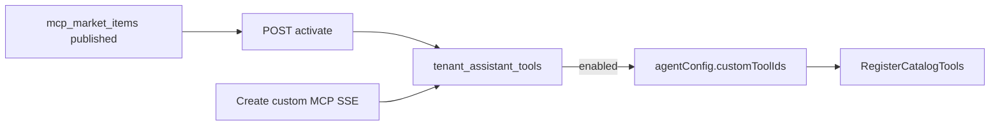

# Tenant MCP Market & My MCPs

Product surfaces (tenant-scoped):

| Surface | Route | Meaning |
|---------|-------|---------|
| **MCP 市场** | `/mcp-market` | Browse published packages → **开通** |
| **我的 MCP** | `/mcp` | Tabs: **已开通** (from market) + **自定义** (tenant-defined) |
| **智能体绑定** | Assistant → Tools | Only **enabled** rows from My MCPs |

## Data

- `mcp_market_items` — marketplace listings (`slug`, SSE URL, status, category, installCount…)
- `tenant_assistant_tools` — connectors with `source=custom|market`, optional `market_item_id`

Empty market auto-seeds a LingMCP demo listing (`http://127.0.0.1:3920/sse`).

## API

Tenant:

- `GET /mcp-market`
- `POST /mcp-market/:id/activate`
- `POST /mcp-market/publish` — publish custom MCP SSE to market
- `GET /assistant-tools?source=custom|market&enabled=1`

Platform:

- `/platform/mcp-market` CRUD

Local LingMCP: see [mcp-tenant-tools.md](./mcp-tenant-tools.md). Localhost/private SSE URLs work without extra SSRF env vars.
