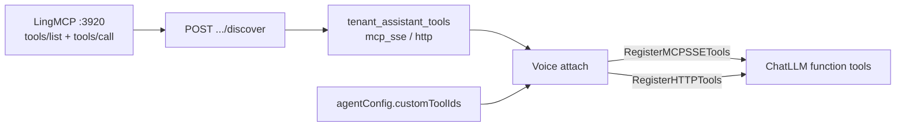

# Tenant assistant custom tools

Tenant-scoped **tool catalog** connects assistants to external capabilities.

**Authoritative tool definitions live in MCP servers** (code). The catalog stores how to reach them (SSE URL / HTTP webhook). `GET /assistant-tools` returns catalog rows — an empty `data: []` means you have not registered a connector yet, not that LingMCP has no tools.

## Architecture



### Layers

1. **MCP server (definition)** — e.g. [LingMCP](../LingMCP/) registers `order_lookup`, `system_info` in code; listens SSE at `http://127.0.0.1:3920/sse`.
2. **Catalog (connection)** — tenant rows of `kind=mcp_sse` (URL + headers) or `kind=http` (simple webhook). Optional `discoveredTools` cache from `tools/list`.
3. **Assistant binding** — `agentConfig.customToolIds`:
   - `"123"` → whole HTTP tool, or all tools on MCP catalog row 123
   - `"123:order_lookup"` → one MCP tool
   - missing key → all enabled catalog connectors (legacy)
   - `[]` → none
4. **Call-time registration**
   - `RegisterCatalogTools` → HTTP + **real MCP SSE** (`initialize` → `tools/list` / `tools/call`)
   - Legacy assistant `mcpServers` / catalog `mcp_stdio` remain advanced (stdio / pseudo-invoke path)

### Tool kinds

| Kind | Runtime | Notes |
|------|---------|-------|
| `mcp_sse` | `RegisterMCPSSETools` | **Primary**. Standard MCP over SSE |
| `http` | `RegisterHTTPTools` | Simple single-URL callbacks |
| `mcp_stdio` | `RegisterMCPTools` | Advanced; not product-first |

### Local LingMCP

```bash
cd LingMCP && go run ./cmd/server
# SSE: http://127.0.0.1:3920/sse
# Health: http://127.0.0.1:3920/healthz
```

If discover fails, check that LingMCP is running and the SSE URL is reachable from the SoulNexus process (e.g. `http://127.0.0.1:3920/sse`). Tenant-configured tool URLs may use loopback or private addresses without `SSRF_WHITELIST`.

## API

Tenant (JWT + `api.assistants.read|write`):

- `GET /api/assistant-tools`
- `GET /api/assistant-tools/:id`
- `POST /api/assistant-tools`
- `PUT /api/assistant-tools/:id`
- `DELETE /api/assistant-tools/:id`
- `POST /api/assistant-tools/:id/discover` — MCP `tools/list`, caches on the row

### Example: MCP SSE connector

```json
POST /api/assistant-tools
{
  "name": "lingmcp",
  "displayName": "LingMCP",
  "kind": "mcp_sse",
  "mcpSseUrl": "http://127.0.0.1:3920/sse",
  "timeoutMs": 15000,
  "enabled": true
}
```

Then `POST .../discover` and bind `"<id>:order_lookup"` on the assistant.

### Example: HTTP order lookup (simple)

```json
POST /api/assistant-tools
{
  "name": "order_lookup_http",
  "kind": "http",
  "method": "POST",
  "url": "https://crm.example.com/api/orders/lookup",
  "bodyTemplate": "{\"orderId\":\"{{orderId}}\"}",
  "parameters": {
    "type": "object",
    "properties": { "orderId": { "type": "string" } },
    "required": ["orderId"]
  },
  "enabled": true
}
```

## UI

- **MCP 市场** `/mcp-market` — 浏览并开通（详见 [mcp-market.md](./mcp-market.md)）
- **我的 MCP** `/mcp` — 「已开通」+「自定义」；刷新 tools/list；自定义可发布到市场
- 智能体「工具」页 — 仅勾选 **已启用** 的我的 MCP
- 进程型 stdio MCP — 专业模式 Developer 页

## Database

- `mcp_market_items`
- `tenant_assistant_tools`（`source` / `market_item_id` / `discovered_tools_json`；`-init` 自动迁移）

## Future work

- Long-lived MCP session per call instead of open-per-invoke
- Explicit assistant ↔ tool binding table
