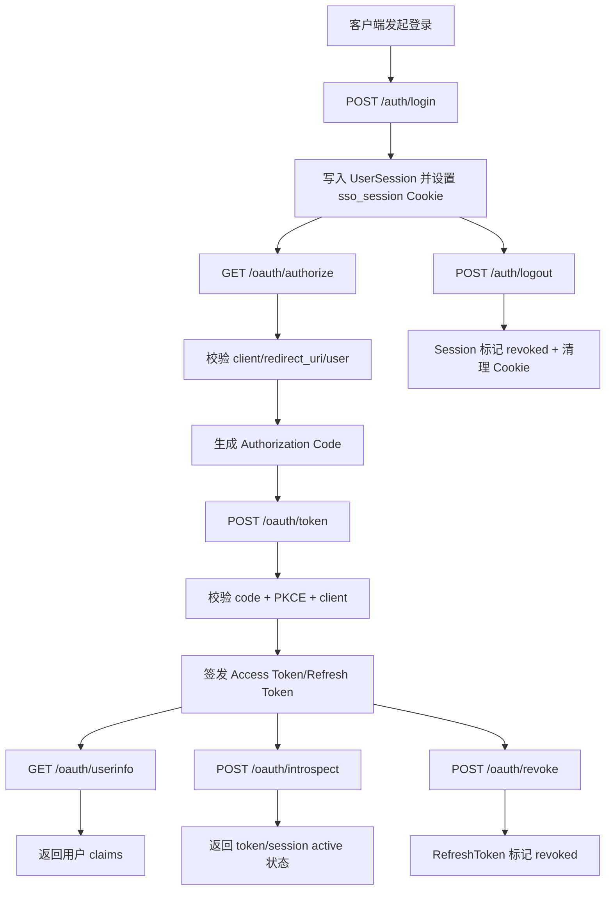
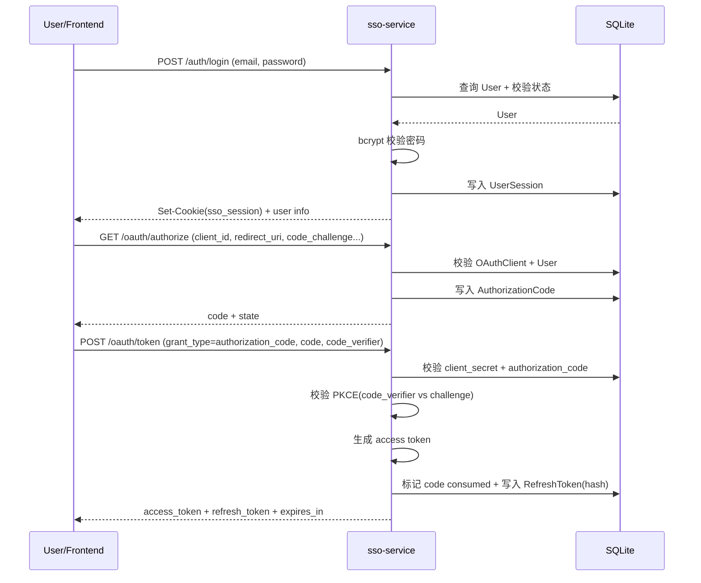
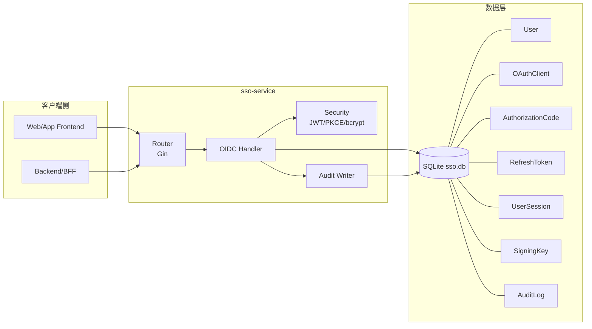

# sso-service 项目分析与流程说明

本文基于当前代码实现，梳理项目结构、核心流程以及系统运行方式，并用 Mermaid 图进行可视化展示。

## 1. 项目定位与技术栈

`sso-service` 是一个基于 Go 的独立认证服务，提供 OAuth2/OIDC 关键能力。SSO 端通过 `sso_session` Cookie 维持全局登录态，子系统通过授权码换取 token 进行鉴权。

核心技术栈：

- Go + Gin（HTTP 服务）
- GORM + SQLite（数据持久化）
- JWT RS256（访问令牌签发与验证）
- bcrypt（密码校验）

## 2. 当前项目结构（按职责）

- `cmd/server/main.go`：服务启动入口
- `internal/config`：环境变量配置加载
- `internal/storage`：数据库连接与迁移
- `internal/bootstrap`：初始化 seed（默认客户端、测试用户）
- `internal/handler`：HTTP 路由与 OIDC 处理逻辑
- `internal/security`：JWT、密码、签名密钥等安全能力
- `internal/models`：数据模型（User、OAuthClient、AuthorizationCode、RefreshToken、UserSession、AuditLog 等）

## 3. 系统整体流程说明

服务启动流程：

1. 加载配置（端口、Issuer、TTL、Cookie 等）
2. 打开 SQLite 并执行模型迁移
3. 初始化默认数据（OAuth Client / Demo User）
4. 确保签名密钥（不存在则生成 RSA 密钥）
5. 初始化 OIDC Handler，注册路由并启动 Gin 服务

认证与授权主流程：

1. 用户登录 `/auth/login`（建立 SSO Session）
2. 客户端请求 `/oauth/authorize` 获取授权码（支持 PKCE）
3. 客户端用授权码请求 `/oauth/token` 换取 token
4. 使用 `/oauth/userinfo`、`/oauth/introspect` 完成用户信息与令牌状态校验
5. 可通过 `/oauth/revoke` 或 `/auth/logout` 进行退出/吊销

## 4. Mermaid 可视化

### 4.1 业务主流程图（Flowchart）

### 4.2 登录 + 授权码换 token 时序图（Sequence）

### 4.3 系统运行架构图（System Runtime）

## 5. 补充说明（当前实现特点）

- 当前为单体 SSO 服务骨架，数据库与服务同进程部署（本地 SQLite）。
- `authorize` 当前返回 JSON（`code + state`），注释中预留后续浏览器重定向能力。
- `/oauth/authorize` 依赖 SSO Session；`/oauth/userinfo` 与 `/oauth/introspect` 使用 Bearer access token。
- 已具备基础审计日志写入能力（登录、换 token、登出等）。
